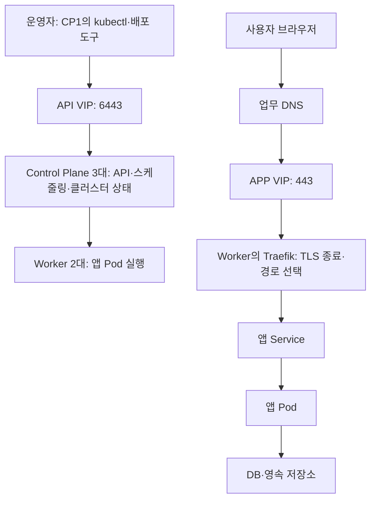

# 00. 전체 그림과 용어

[가이드 홈](README.md) · 다음: [환경 조회](01-baseline.md)

## 무엇을 어디에 배포하나요?

Kubernetes는 여러 서버에 컨테이너를 배치하고 선언한 실행 상태를 유지하는 시스템입니다.
이 프로젝트의 관리 명령과 사용자 접속은 다음처럼 이동합니다. 실제 주소와 확인일은 [현황](../infrastructure/cluster.md)을 봅니다.

API VIP와 APP VIP는 목적이 다릅니다. VIP는 SSH로 들어가 소스를 받는 서버가 아닙니다.
그림의 사용자 경로는 목표 APP VIP 구성입니다. 현재 적용 여부와 Keycloak DNS 전환 여부는 따로 확인합니다.
Control Plane이 3대여도 단일 Worker의 local PV에 저장한 앱 DB가 자동 복제되지는 않습니다.

## 배포 중 만나는 용어

| 용어 | 의미 | 이 프로젝트에서 만나는 곳 |
| --- | --- | --- |
| Node | 클러스터에 등록된 서버 | Control Plane과 Worker |
| kubelet / 런타임 | 노드에서 Pod 상태를 관리 / 컨테이너 실행 | 노드의 서비스·버전 확인 |
| CNI | Pod 네트워크를 구성하는 플러그인 | 노드 간 Pod 통신, 설치 기준 확인 |
| etcd | 클러스터 설정과 상태 저장 | 앱 PostgreSQL과 별도 백업 대상 |
| Namespace | 리소스를 나누는 이름 공간 | Keycloak의 `etch-sso`, Portal의 `tailwind-internal` |
| Pod | 함께 실행되는 컨테이너 단위 | API·Web·DB 프로세스 |
| Deployment / StatefulSet | Pod의 원하는 상태 관리 / 안정적인 이름·스토리지 연결 관리 | Web·Keycloak / PostgreSQL |
| Job / DaemonSet | 완료되는 작업 / 선택한 각 노드의 실행 작업 | migration·client 등록 / FTP |
| Service | Pod에 도달하는 안정적인 내부 접속점 | Pod가 바뀌어도 앱 이름으로 접근 |
| Ingress / Controller | 도메인·경로 규칙 / 그 규칙으로 실제 요청 전달 | Traefik과 앱별 Ingress |
| ConfigMap / Secret | 일반 설정 / 비밀 입력 전달 | env에서 생성하는 앱 설정 |
| PV / PVC | 저장 공간 / 앱의 저장 공간 요청 | Worker의 local PV, MinIO PVC |
| StorageClass | 저장소 공급 정책 | 동적 공급 여부를 실제 클러스터에서 확인 |
| manifest / Kustomize | 리소스 YAML / 공통 원본과 환경별 차이 합성 | 앱별 `k8s` 원본·prod overlay |
| Helm chart / release | 설치 묶음 / 설치된 인스턴스 | Airflow·Monitoring·Headlamp |
| kubeconfig / context | 접속 설정 / 사용할 클러스터·사용자 조합 | 배포 대상 선택 |

## 파일에서 실행까지

1. Git에서 배포 원본을 받습니다. 실제 env·인증서·이미지·차트는 별도로 준비합니다.
2. env 검사와 Kustomize·Helm 렌더로 필요한 입력과 리소스를 확인합니다.
3. 배포 도구가 Secret과 Kubernetes 리소스를 등록합니다.
4. Kubernetes가 노드를 선택하고 이미지를 받아 Pod를 실행합니다.
5. 준비 상태와 실제 HTTPS·로그인·데이터 저장을 확인합니다.

Pod를 지우는 것은 앱 제거·DB 복구 방법이 아닙니다. 관리 리소스가 있으면 Pod가 다시 생성될 수 있습니다.
또한 Secret 값 변경이 DB 계정 비밀번호 자체를 바꾸지는 않습니다.

**이 장의 완료 기준:** 앱 명령은 CP1에서, 데이터 폴더 준비는 해당 Worker에서 수행하며,
사용자 요청은 APP VIP를 거친다는 점을 설명할 수 있습니다.
