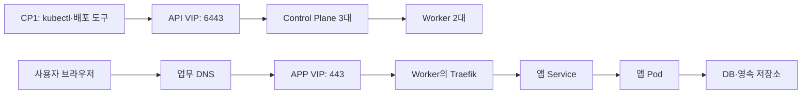

# 00. 용어와 전체 구조

[가이드 홈](README.md) · 다음: [현황 확인](01-baseline.md)

Kubernetes는 여러 서버에 컨테이너를 배치하고 필요한 개수와 실행 상태를 유지합니다.
이 환경의 관리 경로와 목표 사용자 접속 경로는 다음과 같습니다.

APP VIP에서 TCP를 전달하고 Traefik에서 TLS를 종료하는 것이 목표입니다.
실제 LB 설정·양쪽 Worker 응답·Keycloak DNS 전환은 [현황](README.md#현재-서버-상황)의 미확인 항목입니다.
Control Plane 3대나 Traefik 2대 구성이 앱 DB의 복제를 뜻하지는 않습니다.

## 배포할 때 필요한 용어

| 용어 | 뜻 |
| --- | --- |
| Node / Control Plane / Worker | 서버 / 클러스터 관리 노드 / 앱 실행 노드 |
| kubelet / 런타임 / CNI | 노드의 Pod 관리 / 컨테이너 실행 / Pod 네트워크 |
| etcd | 클러스터 상태 저장소. 앱 DB와 별도 백업 대상 |
| Namespace | 앱 리소스의 구역. 예: Keycloak의 `etch-sso` |
| Pod | 컨테이너 실행 단위 |
| Deployment / StatefulSet | Pod 개수·상태 관리 / 안정적인 이름·저장소 연결 관리 |
| Job / DaemonSet | 완료되는 작업 / 선택한 각 노드에서 실행하는 작업 |
| Service / Ingress / Traefik | 앱 내부 접속점 / 도메인·경로 규칙 / 규칙에 따라 요청을 전달하는 컨트롤러 |
| ConfigMap / Secret | 일반 설정 / 비밀 설정을 전달하는 리소스 |
| PV / PVC / StorageClass | 저장 공간 / 저장 공간 요청 / 저장소 공급 정책 |
| manifest / Kustomize | 리소스 YAML / 공통 YAML과 환경별 설정 합성 |
| Helm chart / release | 설치 묶음 / 설치된 인스턴스 |
| kubeconfig / context | 접속 설정 / 사용할 클러스터·계정 조합 |

## 파일이 앱으로 실행되는 순서

1. Git 원본과 실제 env·인증서·이미지·차트를 준비합니다.
2. 입력과 렌더 결과를 검사합니다.
3. 배포 도구가 Kubernetes에 리소스를 등록합니다.
4. 노드가 이미지를 받아 Pod를 실행합니다.
5. HTTPS·로그인·업무 기능을 확인합니다.

`git pull`이나 검사 통과만으로 배포되지는 않습니다.
관리 리소스가 있는 Pod는 삭제해도 다시 생성되며, Secret 변경만으로 DB 계정의 비밀번호가 바뀌지는 않습니다.
