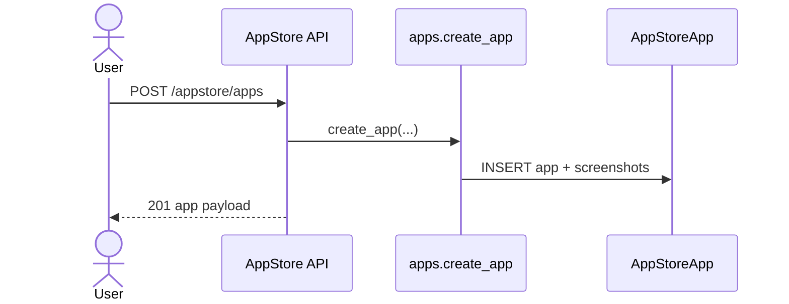
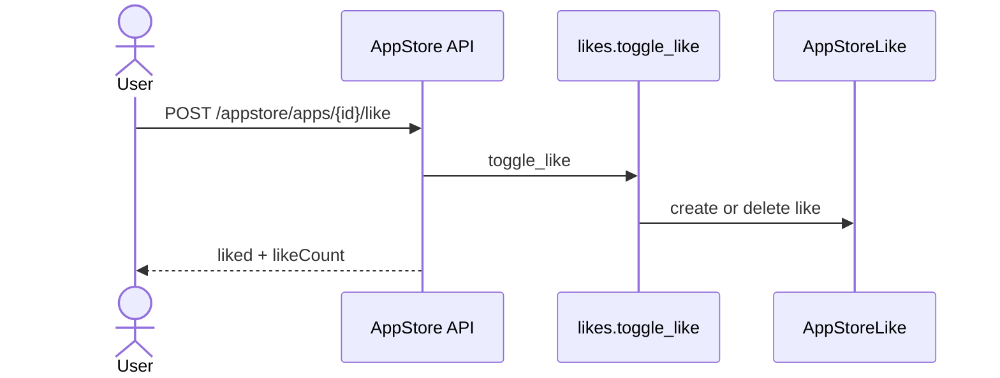
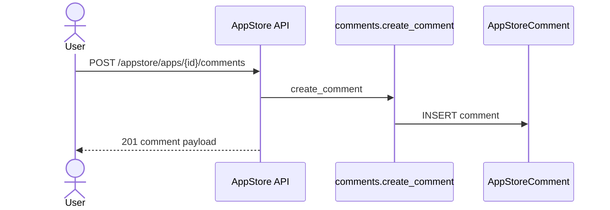

# AppStore 백엔드 로직 (feature: appstore)

## 개요
- 내부 AppStore 앱 등록/조회, 좋아요, 댓글 기능을 제공합니다.
- 앱의 스크린샷은 URL 또는 data URL(base64)로 저장 가능합니다.

## 핵심 모델
- `AppStoreApp` (`appstore_app`)
  - 앱 기본 정보 + 스크린샷(cover + gallery) + 조회수/좋아요 수
- `AppStoreLike` (`appstore_like`)
  - 앱 좋아요 토글 기록
- `AppStoreComment` (`appstore_comment`)
  - 댓글/대댓글(부모 댓글) 구조
- `AppStoreCommentLike` (`appstore_comment_like`)
  - 댓글 좋아요 토글 기록

## 엔드포인트
- `GET /api/v1/appstore/apps`
- `POST /api/v1/appstore/apps`
- `GET /api/v1/appstore/apps/<id>`
- `PATCH /api/v1/appstore/apps/<id>`
- `DELETE /api/v1/appstore/apps/<id>`
- `POST /api/v1/appstore/apps/<id>/like`
- `POST /api/v1/appstore/apps/<id>/view`
- `GET /api/v1/appstore/apps/<id>/comments`
- `POST /api/v1/appstore/apps/<id>/comments`
- `PATCH /api/v1/appstore/apps/<id>/comments/<cid>`
- `DELETE /api/v1/appstore/apps/<id>/comments/<cid>`
- `POST /api/v1/appstore/apps/<id>/comments/<cid>/like`

## 상세 흐름

### 1) 앱 목록 조회
`GET /api/v1/appstore/apps`
1. 최신순 앱 목록 조회 (`comment_count` 포함).
2. 로그인 사용자면 좋아요한 앱 목록 조회.
3. 앱 리스트 직렬화 후 반환.

### 2) 앱 등록
`POST /api/v1/appstore/apps`
1. 인증 확인 + JSON 파싱.
2. 필수값 검증 (`name`, `category`, `url`).
3. tags/스크린샷/연락처 값 정규화.
4. `create_app` → 스크린샷 입력을 cover + gallery로 정규화해 저장.
5. 201 응답 + 생성된 앱 반환.

### 3) 앱 상세 조회
`GET /api/v1/appstore/apps/<id>`
1. 앱 + 댓글 prefetch 조회.
2. 로그인 사용자면 앱/댓글 좋아요 여부 계산.
3. 댓글 포함 payload 반환.

### 4) 앱 수정/삭제
`PATCH /api/v1/appstore/apps/<id>`
1. 인증 확인 + 소유자(superuser 포함) 권한 검사.
2. 업데이트 필드 정규화 + 스크린샷 입력 처리.
3. 저장 후 최신 앱 반환.

`DELETE /api/v1/appstore/apps/<id>`
1. 인증 확인 + 소유자 권한 검사.
2. 앱 삭제.

### 5) 앱 좋아요/조회수
`POST /api/v1/appstore/apps/<id>/like`
1. 인증 확인.
2. `AppStoreLike` 토글 + `like_count` 증감.

`POST /api/v1/appstore/apps/<id>/view`
1. 조회수 증가.

### 6) 댓글/대댓글
`GET /api/v1/appstore/apps/<id>/comments`
1. 댓글 목록 조회(오래된 순).
2. 로그인 사용자면 좋아요 여부 표시.

`POST /api/v1/appstore/apps/<id>/comments`
1. 인증 확인.
2. `content` 필수 확인.
3. parentCommentId가 있으면 동일 앱인지 검증.
4. 댓글 생성 후 반환.

### 7) 댓글 수정/삭제/좋아요
`PATCH /api/v1/appstore/apps/<id>/comments/<cid>`
1. 인증 확인.
2. 작성자/관리자 권한 검사.
3. 내용 업데이트 후 반환.

`DELETE /api/v1/appstore/apps/<id>/comments/<cid>`
1. 인증 확인.
2. 작성자/관리자 권한 검사.
3. 삭제 후 성공 응답.

`POST /api/v1/appstore/apps/<id>/comments/<cid>/like`
1. 인증 확인.
2. `AppStoreCommentLike` 토글 + `like_count` 증감.

## 시퀀스 다이어그램

### 앱 등록

### 앱 좋아요 토글

### 댓글 작성

## 관련 코드 경로
- `apps/api/api/appstore/views.py`
- `apps/api/api/appstore/services/apps.py`
- `apps/api/api/appstore/services/likes.py`
- `apps/api/api/appstore/services/comments.py`
- `apps/api/api/appstore/services/screenshots.py`
- `apps/api/api/appstore/selectors.py`
- `apps/api/api/appstore/serializers.py`
- `apps/api/api/appstore/models.py`
