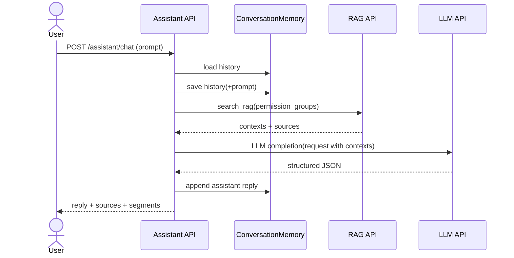
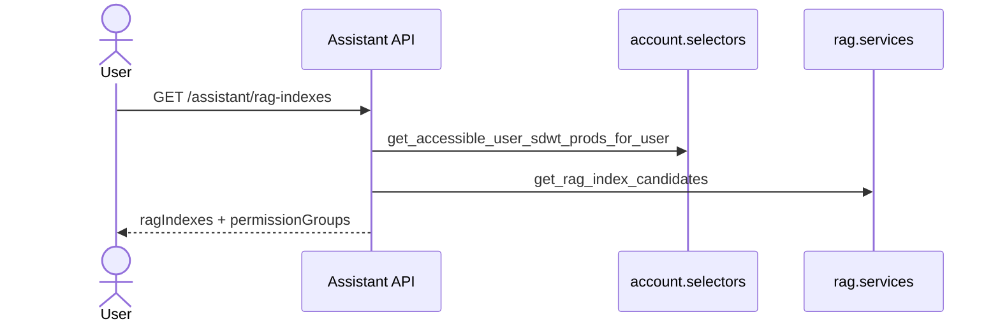

# Assistant 백엔드 로직 (feature: assistant)

## 개요
- RAG 검색 결과를 바탕으로 LLM 응답을 생성하는 채팅 API를 제공합니다.
- permission_groups를 검증해 접근 가능한 RAG 문서만 조회하도록 제한합니다.
- 사용자별 대화 이력을 캐시에 저장해 최근 히스토리를 유지합니다.

## 핵심 구성요소
- `AssistantChatService`: RAG 검색 → LLM 호출 → 구조화 응답 파싱
- `ConversationMemory`: 사용자/room 단위 캐시 저장
- `resolve_permission_groups`: 접근 가능한 그룹만 허용
- `resolve_rag_index_names`: RAG 인덱스 선택 검증
- `build_rag_index_list_payload`: 사용자 기준 선택 가능 인덱스/권한 그룹 제공

## 주요 설정/환경변수
- LLM
  - `ASSISTANT_LLM_URL` (또는 `LLM_API_URL`)
  - `ASSISTANT_LLM_CREDENTIAL` (또는 `LLM_API_KEY`)
  - `ASSISTANT_LLM_MODEL`
  - `ASSISTANT_LLM_TEMPERATURE`
  - `ASSISTANT_LLM_COMMON_HEADERS`
  - `ASSISTANT_REQUEST_TIMEOUT`
- 더미 모드
  - `ASSISTANT_DUMMY_MODE`
  - `ASSISTANT_DUMMY_REPLY`
  - `ASSISTANT_DUMMY_CONTEXTS`
  - `ASSISTANT_DUMMY_DELAY_MS`
  - `ASSISTANT_DUMMY_USE_RAG`
- RAG 연계는 `api.rag` 설정을 사용합니다.

## 엔드포인트
- `GET /api/v1/assistant/rag-indexes`
- `POST /api/v1/assistant/chat`

## 상세 흐름

### 1) RAG 인덱스/권한 그룹 목록
`GET /api/v1/assistant/rag-indexes`
1. 인증 확인.
2. `build_rag_index_list_payload` 실행:
   - 접근 가능한 `user_sdwt_prod` 집합 조회.
   - `sender_id(knox_id)` + `rag-public` 포함.
3. 인덱스 후보/기본 인덱스/권한 그룹 반환.

### 2) 채팅 요청
`POST /api/v1/assistant/chat`
1. JSON 파싱 → `prompt` 필수 확인.
2. 인증 확인 및 `knox_id` 검증.
3. `room_id` 정규화, 입력 history 정규화.
4. `resolve_permission_groups`로 접근 가능 그룹 검증.
5. `resolve_rag_index_names`로 인덱스 목록 정규화.
6. 캐시에서 기존 히스토리 로딩 → 현재 prompt 추가 → 저장.
7. `assistant_chat_service.generate_reply` 호출:
   - RAG 검색 → 문서/출처 추출
   - LLM 호출 → 구조화 응답 파싱
   - segment별 출처 필터링
8. 응답 payload(`reply/contexts/sources/segments/meta`) 반환.

## 시퀀스 다이어그램

### 채팅 요청 흐름

### RAG 인덱스 목록 조회

## 에러/예외 처리
- 잘못된 입력: 400 (prompt/permission_groups/rag_index_name 형식 오류)
- 접근 불가: 403 (permission_groups 미허용 또는 knox_id 없음)
- 설정 누락: 503 (LLM/RAG 설정 미비)
- 외부 호출 실패: 502 (RAG/LLM 요청 실패)

## 관련 코드 경로
- `apps/api/api/assistant/views.py`
- `apps/api/api/assistant/services/chat.py`
- `apps/api/api/assistant/services/normalization.py`
- `apps/api/api/assistant/services/memory.py`
- `apps/api/api/assistant/services/config.py`
- `apps/api/api/assistant/services/reply.py`
