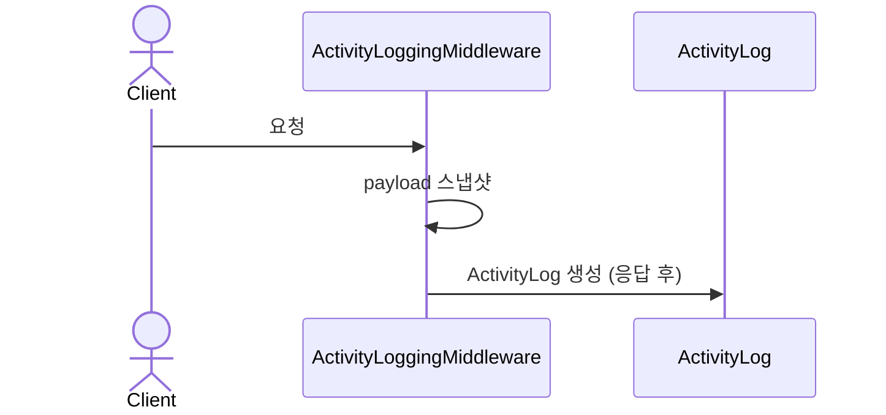
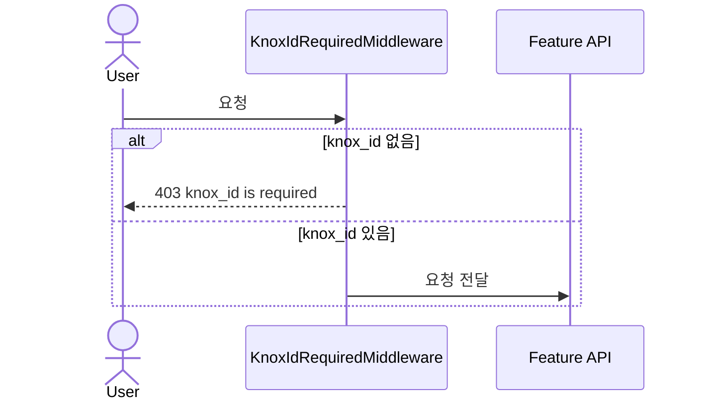
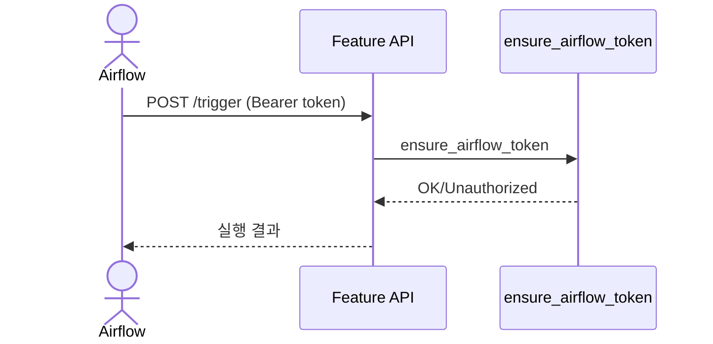

# Common 백엔드 로직 (feature: common)

## 개요
- 여러 기능에서 공통으로 사용하는 유틸리티, 미들웨어, DB 헬퍼를 제공합니다.
- Activity 로그 기록, knox_id 필수 검사, 안전한 SQL/테이블 처리 유틸이 포함됩니다.

## 주요 구성요소
- `ActivityLoggingMiddleware`
  - 변경 요청(POST/PUT/PATCH/DELETE)을 ActivityLog로 기록
- `KnoxIdRequiredMiddleware`
  - 인증 사용자에 대해 `knox_id` 존재 여부 강제 (일부 경로 예외)
- DB 헬퍼
  - `run_query`, `execute`
- 테이블/날짜 유틸
  - `sanitize_identifier`, `resolve_table_schema`, `build_date_range_filters`
- 인증 보조
  - `extract_bearer_token`, `ensure_airflow_token`

## 공통 상수
- `DEFAULT_TABLE = drone_sop`
- `LINE_SDWT_TABLE_NAME = account_affiliation`
- `SAFE_IDENTIFIER` 정규식
- `DATE_COLUMN_CANDIDATES`

## 상세 흐름

### 1) ActivityLoggingMiddleware
1. 요청 시작 시 변경 요청의 payload 스냅샷 저장.
2. 응답 완료 시 ActivityLog 생성:
   - 성공 시 before/after diff 저장.
   - 실패 시 error payload 저장.
3. `/admin/`, `/static/` 등은 기록 제외.

### 2) KnoxIdRequiredMiddleware
1. 특정 경로는 exempt (`/api/v1/auth/`, `/api/v1/health/` 등).
2. 인증 사용자라면 `knox_id`가 없으면 403 반환.

### 3) Airflow 토큰 검증
1. `ensure_airflow_token`은 `AIRFLOW_TRIGGER_TOKEN` 설정값과 비교.
2. Bearer 토큰 형식도 지원.

### 4) 테이블 스키마 해석
1. `sanitize_identifier`로 안전한 테이블명 검증.
2. `list_table_columns`로 컬럼 목록 조회.
3. `pick_base_timestamp_column`로 타임스탬프 후보 결정.

## 시퀀스 다이어그램

### ActivityLog 기록

### knox_id 강제 체크

### Airflow 토큰 검증

## 관련 코드 경로
- `apps/api/api/common/middleware.py`
- `apps/api/api/common/activity_logging.py`
- `apps/api/api/common/utils.py`
- `apps/api/api/common/db.py`
- `apps/api/api/common/constants.py`
- `apps/api/api/common/schema.py`
