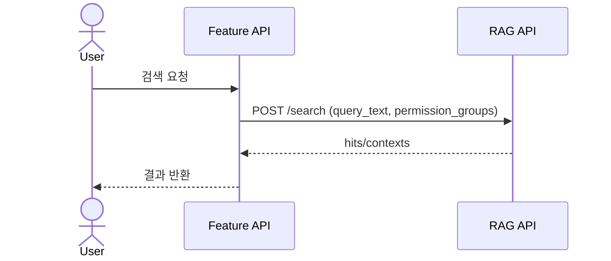
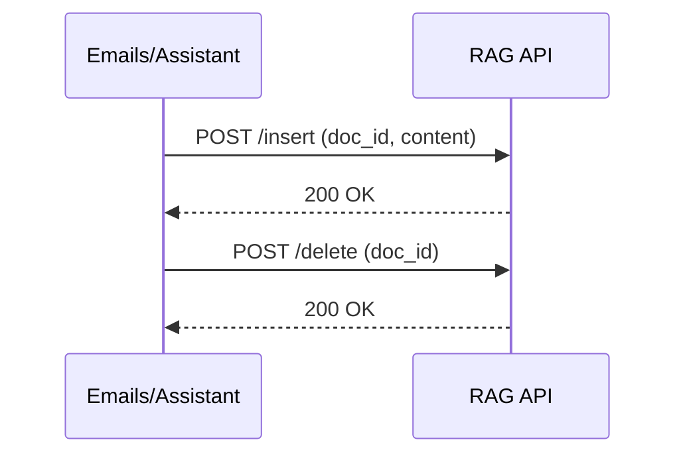

# RAG 백엔드 로직 (feature: rag)

## 개요
- RAG 서버 호출을 위한 공통 클라이언트와 설정 로딩을 제공합니다.
- Emails/Assistant 기능에서 RAG 검색/삽입/삭제에 사용됩니다.

## 핵심 설정/환경변수
- URL
  - `ASSISTANT_RAG_URL` 또는 `RAG_SEARCH_URL`
  - `ASSISTANT_RAG_INSERT_URL` 또는 `RAG_INSERT_URL`
  - `ASSISTANT_RAG_DELETE_URL` 또는 `RAG_DELETE_URL`
- 인덱스
  - `ASSISTANT_RAG_INDEX_NAME` 또는 `RAG_INDEX_NAME`
  - `ASSISTANT_RAG_INDEX_DEFAULT` 또는 `RAG_INDEX_DEFAULT`
  - `ASSISTANT_RAG_INDEX_EMAILS` 또는 `RAG_INDEX_EMAILS`
  - `ASSISTANT_RAG_INDEX_LIST` 또는 `RAG_INDEX_LIST`
- 권한 그룹
  - `ASSISTANT_RAG_PERMISSION_GROUPS` 또는 `RAG_PERMISSION_GROUPS`
  - `RAG_PUBLIC_GROUP` 기본값: `rag-public`
- 기타
  - `ASSISTANT_RAG_HEADERS` 또는 `RAG_HEADERS`
  - `RAG_PASS_KEY`, `RAG_API_KEY`
  - `ASSISTANT_RAG_CHUNK_FACTOR` 또는 `RAG_CHUNK_FACTOR`
  - `RAG_ERROR_LOG_PATH`

## 주요 API 함수
- `search_rag(query_text, index_name, num_result_doc, permission_groups)`
- `insert_email_to_rag(email, index_name, permission_groups)`
- `delete_rag_doc(doc_id, index_name, permission_groups)`
- `resolve_rag_index_name` / `resolve_rag_index_names`

## 상세 흐름

### 1) 인덱스/권한 그룹 정규화
1. 인덱스 이름은 설정값/입력값 기준으로 정규화.
2. permission_groups는 JSON 배열 또는 CSV 문자열을 허용.
3. 비어있으면 `rag-public` 기본 그룹 사용.

### 2) RAG 검색
1. 입력 쿼리/인덱스/permission_groups 정규화.
2. `RAG_SEARCH_URL` 유효성 확인.
3. RAG 서버에 POST 요청.
4. JSON 응답 파싱 (실패 시 예외 및 로그).

### 3) RAG 삽입(이메일)
1. Email 기반 payload 구성.
2. permission_groups는 user_sdwt_prod + sender_id 기반 또는 override.
3. `RAG_INSERT_URL` 유효성 확인 후 POST.
4. 실패 시 `_log_rag_failure`로 파일 로그 기록.

### 4) RAG 삭제
1. doc_id 기반 삭제 payload 생성.
2. `RAG_DELETE_URL` 유효성 확인 후 POST.
3. 실패 시 로그 기록.

## 시퀀스 다이어그램

### RAG 검색

### RAG 삽입/삭제

## 관련 코드 경로
- `apps/api/api/rag/services/config.py`
- `apps/api/api/rag/services/client.py`
- `apps/api/api/rag/services/logging.py`
