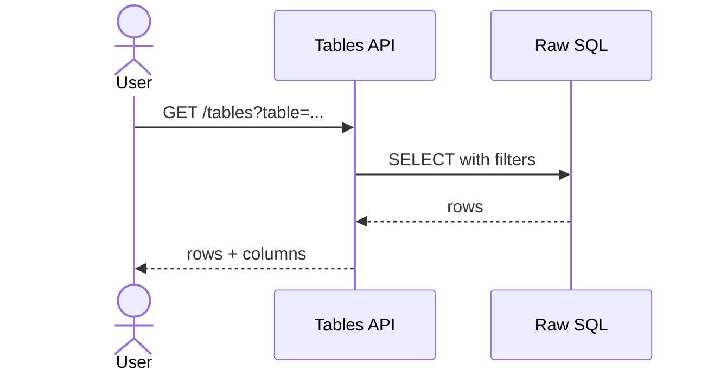
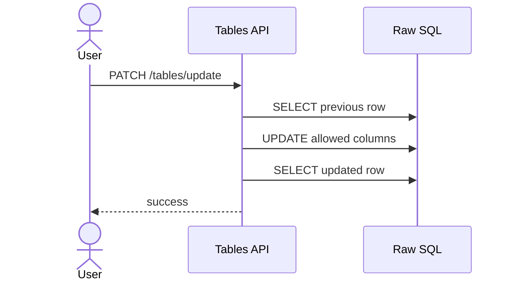

# Tables 백엔드 로직 (feature: tables)

## 개요
- 지정한 테이블을 조회하거나 부분 업데이트하는 범용 API를 제공합니다.
- 안전한 식별자 검증과 제한된 컬럼 업데이트를 적용합니다.

## 주요 설정/규칙
- 기본 테이블: `DEFAULT_TABLE = drone_sop`
- 식별자 안전성: `SAFE_IDENTIFIER` 정규식 통과 필수
- 업데이트 허용 컬럼: `comment`, `needtosend`, `instant_inform`, `status`

## 엔드포인트
- `GET /api/v1/tables/`
- `PATCH /api/v1/tables/update`

## 상세 흐름

### 1) 테이블 조회
`GET /api/v1/tables/`
1. `resolve_table_schema`로 테이블/컬럼/타임스탬프 컬럼 확인.
2. lineId, from/to, recentHours 범위를 SQL 조건으로 변환.
3. raw SQL 조회 결과 반환.

### 2) 테이블 부분 업데이트
`PATCH /api/v1/tables/update`
1. JSON 파싱 → `table`, `id`, `updates` 필수 검증.
2. 테이블 컬럼 목록 조회.
3. 허용 컬럼만 UPDATE 대상으로 선택.
4. UPDATE 실행 후 업데이트 전/후 row 재조회.
5. ActivityLog에 변경 내용 기록.

## 시퀀스 다이어그램

### 테이블 조회

### 테이블 업데이트

## 관련 코드 경로
- `apps/api/api/tables/views.py`
- `apps/api/api/tables/services/listing.py`
- `apps/api/api/tables/services/update.py`
- `apps/api/api/tables/selectors.py`
- `apps/api/api/common/utils.py`
