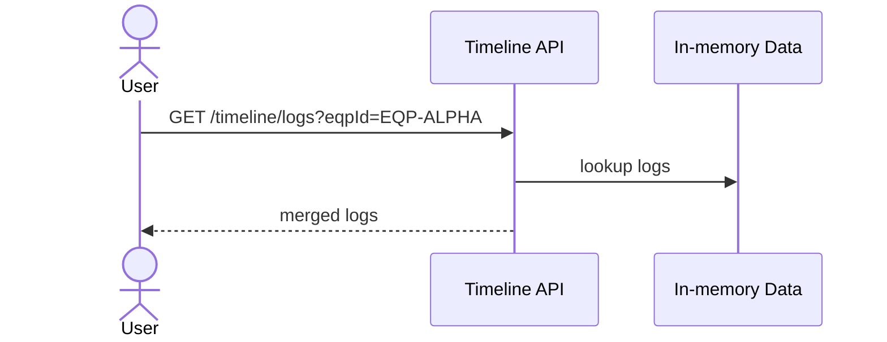

# Timeline 백엔드 로직 (feature: timeline)

## 개요
- 프론트 타임라인 기능을 위한 더미 데이터 API입니다.
- DB 없이 in-memory 샘플 데이터를 반환합니다.

## 엔드포인트
- `GET /api/v1/timeline/lines`
- `GET /api/v1/timeline/sdwts?lineId=...`
- `GET /api/v1/timeline/prc-groups?lineId=...&sdwtId=...`
- `GET /api/v1/timeline/equipments?lineId=...&sdwtId=...&prcGroup=...`
- `GET /api/v1/timeline/equipment-info/<line_id>/<eqp_id>`
- `GET /api/v1/timeline/equipment-info/<eqp_id>`
- `GET /api/v1/timeline/logs?eqpId=...`
- `GET /api/v1/timeline/logs/eqp?eqpId=...`
- `GET /api/v1/timeline/logs/tip?eqpId=...`
- `GET /api/v1/timeline/logs/ctttm?eqpId=...`
- `GET /api/v1/timeline/logs/racb?eqpId=...`
- `GET /api/v1/timeline/logs/jira?eqpId=...`

## 상세 흐름

### 1) 라인/SDWT/공정/설비 목록
1. `lineId/sdwtId/prcGroup` 파라미터를 정규화(대문자).
2. 미입력/유효성 실패 시 400 반환.
3. in-memory map에서 목록 반환.

### 2) 설비 정보 조회
1. `eqpId`로 설비 메타데이터 조회.
2. `line_id`가 전달되면 line 범위 일치 여부 추가 검증.

### 3) 로그 조회
1. `eqpId` 필수.
2. 타입별 또는 전체 로그를 in-memory map에서 반환.
3. 전체 로그는 eventTime 기준 정렬.

## 시퀀스 다이어그램

### 설비 로그 조회

## 관련 코드 경로
- `apps/api/api/timeline/views.py`
- `apps/api/api/timeline/selectors.py`
