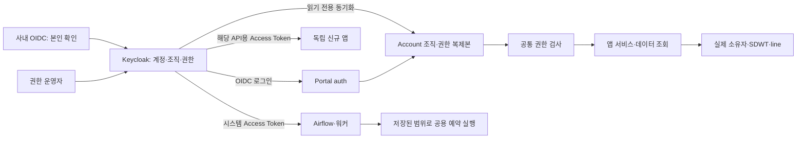

# ExecPlan: Keycloak 조직·앱 권한 통합

## 목표

Keycloak에서 사용자의 소속과 모든 앱의 권한 부여를 관리한다. 각 앱은 검증한 Keycloak 정보와 실제 업무 데이터의 범위를 대조해 요청을 허용한다. 운영자는 주로 SDWT별 `관리자 / 사용자 / 뷰어` 그룹에 사용자를 배정하고, 앱별 예외와 line 단위 권한만 별도로 설정한다.

- 상태: **상세 설계안 작성 완료, 구현·운영 설정 적용 전**.
- 기준일: 2026-09-12. 실제 배포 시에는 코드·Keycloak 버전·데이터 현황을 다시 확인한다.
- 이 문서는 앞선 설명을 구현 가능한 계약으로 구체화한다. 기존 계획 문서의 완료 표시는 이번 전환의 완료를 뜻하지 않는다.
- 이번 작업의 산출물은 이 문서다. 현재 작업 트리에 있는 인증·인프라 변경사항은 별도 사용자 작업으로 보존한다.

### 합의한 대전제

1. 조직 계층은 `팀 → line → SDWT → 사용자`다.
2. `department`가 팀이다. 사내 OIDC의 `deptname`도 같은 조직 단위를 뜻한다. 별도 `team` 필드를 추가하지 않는다.
3. SDWT는 전체 조직에서 유일하며 하나의 line에 속한다. line 이름 자체의 전역 유일성은 가정하지 않는다.
4. 실제 소속과 접근 권한은 구분한다. A 소속 사용자가 A 관리자이면서 B 뷰어일 수 있다.
5. Keycloak이 소속·권한의 최종 원본이다. 앱 DB에는 조회용 복제본과 업무 데이터만 둔다.
6. 일반 사용자 권한은 앱·기능·데이터 범위를 묶어 부여한다. `관리자`와 `접근 가능한 SDWT 목록`을 따로 조합하지 않는다.
7. 현재 소속이라는 이유로 쓰기 권한을 자동 부여하지 않는다.
8. 메일 예약은 조직의 공용 설정이다. 등록자 탈퇴·계정 삭제·전보·권한 상실로 예약을 중지하거나 삭제하지 않는다.
9. 메일 예약의 등록자는 감사 기록이다. 현재 해당 범위의 관리 권한을 가진 사람이 관리한다.
10. 메일 수집·Outbox·자동 발송은 사람의 역할과 분리된 시스템 권한을 사용한다.
11. 포털의 권한 신청·승인·자동 부서 정책·소속 직접 변경을 권한 원본에서 제거한다.
12. 독립 앱이 추가되어도 같은 계약으로 Keycloak에 연결한다. 새 앱이 포털 DB에 의존할 필요는 없다.

### 권장안이며 구현 착수 전에 정책을 확정할 항목

계획 작성은 아래 답변 없이 진행할 수 있다. 실제 동작을 바꾸는 해당 단계 전에는 답변을 반영해야 한다. 아래 수치나 세부 권한표를 이미 사용자에게 승인받았다고 간주하지 않는다.

| 번호 | 결정할 내용 | 이 문서의 권장안 | 선택이 미치는 영향 |
| --- | --- | --- | --- |
| D1 | 자동 메일 수신자 정책 | 해당 범위 관리자가 지정한 주소 목록으로 발송. 수신자별 Keycloak 권한 검사는 하지 않음 | 공용 메일함·배포 목록 지원. 관리자가 정보 배포 범위를 책임짐 |
| D2 | 사용자 권한 갱신·장애 허용 시간 | 로그인 시 조회, 활동 사용자 5분 주기 확인, 마지막 검증 후 최대 15분까지 사용 | 처음 논의한 로그인 시 반영에서 주기적 반영으로 확장. 변경 지연과 장애 시 가용성의 절충 |
| D3 | 신규 사용자 기본 권한 | 기본 홈·프로필만 제공. 개인 발신 메일 조회는 Keycloak의 별도 기본 그룹으로 명시 부여 | 개인 메일 접근을 소속 권한과 분리하되, 기본 그룹에 포함할지 확정 필요 |
| D4 | 앱별 세부 역할 묶음 | 아래 앱별 표를 초안으로 사용. 삭제·운영 설정은 관리자, 일반 업무 작성은 사용자 | 실제 API별 기능 분류를 완료한 표를 해당 앱 전환 전에 검토 |
| D5 | 메일 소속 분류용 직원 등록 범위 | 로그인하지 않는 메일 발신자도 Keycloak에 사전 등록하고 주기 동기화 | Keycloak에 없는 직원의 소속은 알아낼 수 없으므로 미분류로 처리 |

메일 예약의 유지 여부는 미확정 항목이 아니다. 이미 유지하기로 합의했다. 배포 전 기존 예약의 실제 line 범위를 정하는 작업은 정책 질문과 별개의 데이터 검토 작업이다.

## 현재 상태

### 코드에서 확인한 사실

| 영역 | 현재 구현 | 전환 시 필요한 조치 |
| --- | --- | --- |
| 인증 | `auth/services/keycloak_oidc.py`에 Keycloak OIDC 검증 구현이 작업 트리에 있음 | 기존 작업을 검토·재사용하고 새로운 인증 구현을 중복 생성하지 않음 |
| 사용자 식별 | `account/services/identity.py`가 사번으로 사용자 upsert. `oidc_claims.py`가 `deptname → department` 매핑 | 기존 로컬 사용자 ID를 유지하면서 `issuer + subject`를 연결. Keycloak 소속을 회사 claim으로 덮어쓰지 않음 |
| 조직 | `Affiliation`에 department·line·user_sdwt_prod, `UserCurrentAffiliation`에 현재 소속 | Keycloak 조직의 읽기 전용 복제본으로 전환 |
| SDWT 역할 | `UserSdwtProdAccess`의 viewer/member/manager와 현재 소속의 암묵적 member 승격 | Keycloak의 명시적 기능·범위 권한으로 교체 |
| 앱 권한 | `AccessScope`, `UserAccess`, `AccessPolicyRule`, `UserScopeAffiliationGrant` 등 | 쓰기 경로 폐쇄 후 판정 의존을 제거하고 마지막 단계에 정리 |
| 공통 게이트 | `common/permissions.py`, middleware가 포털·앱 진입을 검사 | 인증과 앱별 실제 행동·데이터 검사로 책임 구분 |
| 우회 | `account/services/access_runtime.py`에 `is_superuser` 우회 | 운영 API의 업무 권한 우회 제거. 운영 Django `/admin` 비활성화 |
| 메일 수집 | `emails/views/triggers.py`가 정적 토큰 또는 로그인 사용자 세션을 허용 | 시스템 인증만 허용. 사람 로그인으로 수집을 실행하는 경로 제거 |
| 메일 분류 | `emails/selectors/mailboxes.py`가 발신자와 현재 소속·외부 추정 정보를 사용 | Keycloak 디렉터리 복제본과 미분류 처리 사용 |
| 메일 이동 | `emails/services/mutations.py`가 원본·대상 소속 권한을 재검사 | 트랜잭션 보호를 유지하면서 새 권한 검사로 교체 |
| 메일 예약 | `L3SpiderMailRule.created_by`가 CASCADE, 작성자·개별 공유로 관리 | SET_NULL, 생성자 기록 보존, 저장된 line 범위로 관리 |
| 예약 직렬화 | `_serialize_mail_rule()`가 `created_by` 직접 참조. 사용자 인자 없으면 owner 권한 기본값 | 삭제 계정 안전 처리, 기본 권한 허용 제거 |
| 예약 조회 | L3 selector가 작성자 또는 공유 사용자를 필터 | 해당 예약의 전체 범위를 관리할 수 있는 사용자 기준으로 변경 |
| 예약 실행 | `receiver_emails` 여러 주소로 발송. 작성자 권한을 현재도 매번 확인하지 않음 | 공용 실행 유지, 데이터 범위 제한을 추가 |
| 예약 데이터 범위 | `line_id='*'` 및 파일 fallback이 여러 line을 탐색 가능 | 고정된 허용 line 집합을 먼저 적용하고 그 안에서 패턴 검색 |
| Assistant | 사용한 출처 권한을 기록하고 재검사하는 구현 존재 | 새 권한 계약과 개인 메일 권한을 연결. 검색·스트리밍 시작 전 검사 |
| 운영 설정 | Drone 일부 수신자 관리가 인증 여부만 확인 | 해당 데이터 범위의 명시적 설정 관리 권한 요구 |
| 접속 현황 | activity에 Django permission 사용 | `access-stats`의 Keycloak 권한으로 교체 |
| 프론트엔드 | 앱 게이트, 권한 신청, 소속 선택·재확인, 예약 공유 UI 존재 | 새 `/auth/me` 계약과 서버 계산 capabilities를 사용 |

### 실제 앱과 데이터 단위

- `emails`, `observer`: SDWT 단위가 주요 기준이다. Observer의 설비·공정 식별자를 사용자 SDWT로 오인하지 않는다.
- `l0-spider`, `pm-spider`의 backend `pm_comparison`, `tttm-spider`, L3 데이터: 실제 데이터가 line 단위인 경로를 그대로 인정한다.
- `line-dashboard`: backend `drone`을 포함한다. SDWT 단위 화면과 line 집계·운영 설정을 나눠 조사한다.
- `appstore`, `voc`: 공용 게시물과 작성자 소유 관계가 있다. 존재하지 않는 SDWT 소유권을 만들어 붙이지 않는다.
- `l1-spider`: 현재 외부 링크 진입이다. 대상 앱이 직접 인증·권한 검사에 연결되기 전에는 포털 링크 노출만 제어할 수 있다.
- `teamstaff`: 실제 제공 자원과 누락된 이미지 상태를 확인한 뒤 존재하는 경로만 분류한다. 이번 작업으로 새로운 파일 API를 만들지 않는다.

현재 Keycloak 배포 파일은 26.7.1을 참조한다. 확인한 최신 관리 문서는 26.7.3이므로, 설정 동작은 배포 버전으로 재현한다. Keycloak 및 DB가 단일 인스턴스인 현재 배포에 임의의 가용성·수용 인원 보장을 붙이지 않는다.

## 범위

### 포함

- Keycloak realm·client·조직 그룹·접근 그룹·역할 묶음·mapper 설계와 재현 가능한 설정 절차.
- 인증 식별자 연결, 읽기 전용 조직·권한 복제, 공통 권한 함수.
- 모든 현재 사용자 API와 파일·다운로드·RAG 경로의 권한 분류 및 적용.
- 메일 수집 등 시스템 API, 조직 공용 예약과 데이터 전환.
- 프론트엔드 권한 표현, 로컬 dummy, 환경 설정, 문서, 회귀 테스트.
- 신규 앱 온보딩 계약, 운영자 업무 절차, 전환·복구 계획.

### 이번 전환에서 만들지 않는 것

- 별도 IAM 서버, 범용 정책 언어, Keycloak 커스텀 SPI·스크립트 mapper, 문서별 Keycloak 리소스 등록.
- 실시간 권한 이벤트 버스, 과거 조직 이력을 완전히 재구성하는 인사 시스템.
- 포털 안에 Keycloak 관리 콘솔을 복제한 권한 편집 UI.
- 기존에 없는 앱의 쓰기·삭제 기능, 관련 없는 UI 개편·배포 구조 개편.
- 자동 커밋·푸시·운영 배포.

## 설계

### 1. 책임과 전체 흐름



Keycloak은 누구에게 어떤 기능을 허용했는지 관리한다. 앱은 이메일 123의 소속이나 예약 456의 대상 line처럼 앱 DB에 있는 사실을 확인한다. 이 대조는 앱의 필수 책임이며, 권한 부여를 앱에서 별도로 관리한다는 뜻은 아니다.

공통 판정은 다음과 같다.

```text
허용 = 유효한 주체
    AND 사용 가능한 검증 정보
    AND 이 앱의 해당 기능 권한
    AND 실제 대상이 권한에 명시된 범위에 포함
    AND 해당 기능의 업무 조건 충족
```

목록 필터, 상세 조회, 수정, 다운로드, 이미지, 통계, 검색, 백그라운드 실행을 각각 검사한다. 프론트엔드 메뉴 숨김은 편의 기능이다.

### 2. Keycloak의 구성 단위

#### 2.1 Realm과 clients

| 구성 | 제안 용도 | 운영 원칙 |
| --- | --- | --- |
| 기존 업무 realm | 같은 조직의 공통 계정·조직·권한 | 앱마다 realm을 만들지 않음. `master`를 업무 realm으로 사용하지 않음 |
| 기존 Portal 로그인 client | 서버 로그인과 세션 생성 | 기존 client ID를 확인해 재사용. Authorization Code + PKCE 유지 |
| `portal-api` 역할 client | 현재 모놀리스 API의 앱별 atomic client roles | 논리 이름 예시. 기존 client 재사용 가능 여부를 조사한 뒤 확정 |
| `org-access-bundles` 역할 client | 여러 앱을 묶는 공통 composite 역할 | 로그인 기능을 켜지 않는 역할 정리용 client |
| `portal-directory-reader` | Portal이 조직·사용자·유효 역할을 조회 | 최소 읽기 권한의 서비스 계정. 사용자/역할 수정 권한 없음 |
| 워커별 confidential client | ingest, outbox, OCR, 예약 발송 등 | 필요한 시스템 기능만. 서로 다른 작업에 동일 비밀값을 돌려 쓰지 않음 |
| 새 독립 앱의 로그인/API client | 새 앱의 로그인·API audience·client roles | 기존 Portal 역할을 모두 전달하지 않음 |

Realm management 권한과 업무 `admin` 역할은 별개다. SDWT 관리자는 기본적으로 Keycloak 사용자 편집·역할 부여 권한을 갖지 않는다. 초기에는 지정된 중앙 운영자만 조직·권한을 변경한다. SDWT 관리자에게 권한 부여까지 위임하려면 별도 관리 권한 범위와 자기 승격 방지 검증을 설계한 뒤 추가한다.

#### 2.2 조직 그룹: 실제 소속만 표현

```text
/org
  /생산1팀                         department_id=dep-001
    /LINE_1                       line_id=line-001
      /SDWT_A                     sdwt_id=sdwt-001
        김대리
      /SDWT_B                     sdwt_id=sdwt-002
  /생산2팀                         department_id=dep-002
    /LINE_1                       line_id=line-002
      /SDWT_C                     sdwt_id=sdwt-003
```

- 사람이 읽는 이름과 변경하지 않는 식별자를 구분한다. 두 팀의 `LINE_1`은 다른 `line_id`다.
- 식별자는 한 번 정하면 이름 변경·조직 이동에도 재사용·재발급하지 않는다. 폐지한 식별자를 새 조직에 주지 않는다.
- 조직 그룹을 삭제하고 같은 이름으로 재생성하는 것을 단순 이름 변경으로 처리하지 않는다.
- 사용자는 하나의 SDWT leaf 그룹에만 직접 가입한다. 팀·line 상위 그룹에 추가 가입할 필요가 없다.
- 신규 미배정 사용자는 조직 그룹 0개를 허용하되 자동 권한은 없다. 2개 이상 배정은 오류다.
- `/org`와 하위 조직 그룹에는 업무 역할을 붙이지 않는다.
- 소속 변경은 조직 그룹 이동이다. 기존 접근 그룹은 별도로 검토·제거·추가한다. 이동만으로 접근 권한이 정리됐다고 가정하지 않는다.
- 각 조직 그룹에는 관리용 `org_lifecycle=active|retired`를 둔다. 이는 우리가 정의하는 속성이며 Keycloak의 내장 그룹 활성화 스위치가 아니다. 동기화는 자기 그룹과 부모의 상태로 유효 활성 여부를 계산한다.
- 조직 폐지는 해당 범위 grant 회수·연관 예약 처리·디렉터리 반영을 함께 수행한다. 속성 하나를 바꾸면 모든 독립 앱의 기존 토큰이 즉시 차단된다고 가정하지 않는다.

Keycloak의 일반 realm Groups를 사용한다. B2B용 `Organizations` 기능을 이 조직 계층을 위해 추가 도입하지 않는다. 그룹의 계층과 역할 상속은 기본 기능이지만 한 사용자 한 SDWT 규칙은 우리 계약에서 검증해야 한다. [Keycloak 그룹 설명](https://www.keycloak.org/docs/latest/server_admin/index.html#_groups)

#### 2.3 조직 속성과 claim mapper

조직 정보를 사용자마다 중복 입력하지 않도록 각 단계의 그룹에 자기 단계의 속성만 저장한다.

| 저장 위치 | 그룹 속성 | 토큰 claim |
| --- | --- | --- |
| 팀 | `org_department_id`, `org_department_name` | `org.department_ids`, `org.department_names` |
| line | `org_line_id`, `org_line_name` | `org.line_ids`, `org.line_names` |
| SDWT | `org_sdwt_id`, `org_sdwt_name` | `org.sdwt_ids`, `org.sdwt_names` |

- `org-claims-v1` client scope에 기본 User Attribute mapper를 등록한다.
- 각 mapper는 `Aggregate attribute values=ON`, `Multivalued=ON`, 문자열 값을 사용한다.
- 단일값을 임의 선택하지 않도록 배열로 전달한 뒤 앱이 각 단계 1개인지 검증한다.
- `org_*` 속성은 사용자 직접 속성이나 `/access` 그룹에 복제하지 않는다. 같은 키의 중복·오염을 정기 무결성 검사로 탐지한다.
- 사용자의 프로필 편집으로 조직 ID·사번 등 신뢰 필드를 수정할 수 없도록 User Profile 권한을 설정한다.
- 실제 계층의 정합성은 Portal 동기화가 그룹 트리와 직접 대조한다. 토큰 소비 앱은 유일값·형식·버전을 검사하며 발급자의 관리 정확성을 신뢰한다.
- 정상 claim은 여섯 필드에 각각 값 1개, 미배정은 모두 없음이다. 일부 필드만 있거나 다중값이면 정상 소속으로 정규화하지 않는다.
- 조직 이름에 `/`가 있어도 이름 경로를 권한 식별자로 파싱하지 않는다.
- `department`, `line`, `user_sdwt_prod`가 필요한 현재 API에는 검증한 조직 정보에서 기존 필드로 투영한다. 별도 편집값은 두지 않는다.

26.7.1 기본 mapper는 aggregate 옵션으로 사용자·그룹·상위 그룹의 속성을 모을 수 있다. 이 동작을 사용하되 실제 토큰의 배열·중첩 형식은 통합 테스트로 확인한다. [UserAttributeMapper 소스](https://raw.githubusercontent.com/keycloak/keycloak/26.7.1/services/src/main/java/org/keycloak/protocol/oidc/mappers/UserAttributeMapper.java), [속성 해석 소스](https://raw.githubusercontent.com/keycloak/keycloak/26.7.1/server-spi-private/src/main/java/org/keycloak/models/utils/KeycloakModelUtils.java)

사내 `deptname`은 초기 팀 배정 참고값 또는 별도 `corporate_deptname` 비교값으로 보관할 수 있다. 이를 Keycloak 관리 조직 속성에 `Force` 매핑하지 않는다. 이름·메일 등의 기본 프로필 mapper와 소속 mapper의 갱신 정책은 각각 구분한다. [IdP mapper 동기화 설정](https://www.keycloak.org/docs/latest/server_admin/index.html#_mappers)

#### 2.4 접근 그룹: 사용할 수 있는 범위와 역할

```text
/access
  /sdwt
    /sdwt-001
      /admin                      김대리
      /user
      /viewer
    /sdwt-002
      /admin
      /user
      /viewer                     김대리
  /app
    /emails
      /sdwt-003
        /viewer
  /line
    /line-001
      /l3-spider-admin
  /global
    /access-stats-viewer
  /basic
    /personal-mail-reader
```

- 위 이름은 운영 규약이다. Keycloak이 `admin`이라는 그룹 이름을 특별 취급하는 것은 아니다.
- 부모 폴더에는 역할을 붙이지 않는다. leaf에만 대상 composite 역할을 배정한다.
- 일반적으로 공통 SDWT 그룹 하나를 선택한다. 같은 SDWT에서 admin/user/viewer 중복은 오류 또는 정리 대상으로 탐지한다.
- 사용자에게 atomic role을 직접 부여하는 방식은 일상 운영에서 사용하지 않는다. 기존 직접 부여가 발견되면 유효 권한에는 반영하되 운영 경고·정리 대상으로 보고한다.
- 앱 예외가 필요하면 공통 그룹을 제거하고 앱별 그룹으로 대체한다. 공통 admin에 앱 viewer를 추가해도 권한이 낮아지지 않는다.

#### 2.5 역할 묶음 구조

```text
SDWT_A 공통 관리자 composite
  → Emails SDWT_A 관리자 composite
      → emails.message.read@sdwt:sdwt-001
      → emails.message.move@sdwt:sdwt-001
      → emails.message.delete@sdwt:sdwt-001
  → Observer SDWT_A 뷰어 composite
      → observer.equipment.read@sdwt:sdwt-001
  → 해당 SDWT 단위로 제공되는 다른 앱 역할
```

기본 깊이는 `공통 묶음 → 앱 묶음 → atomic role`로 제한한다. 앱별 user/admin 묶음은 필요한 atomic roles를 명시해서 중첩 확산을 피한다. 기본 기능이 읽기뿐인 앱에서는 user/admin이라는 이름 때문에 새로운 쓰기 권한을 만들지 않는다.

공통 묶음은 운영 편의다. 실제 허용 여부는 펼쳐진 atomic roles만 사용한다. 새 앱이나 새 삭제 기능을 기존 묶음에 넣는 것은 권한 확대이므로 영향 사용자를 확인한 뒤 명시적으로 변경한다. [Composite roles](https://www.keycloak.org/docs/latest/server_admin/index.html#_composite-roles)

### 3. 권한 계약 v1

#### 3.1 Atomic role 문법

```text
<app>.<resource>.<action>@<scope_type>:<scope_id>
```

| 예시 | 의미 |
| --- | --- |
| `emails.message.read@sdwt:sdwt-001` | SDWT_A의 메일 조회 |
| `emails.message.move@sdwt:sdwt-001` | SDWT_A를 원본 또는 대상으로 하는 이동의 해당 범위 권한 |
| `emails.message.delete@sdwt:sdwt-001` | SDWT_A 메일 삭제 |
| `emails.message.read@own:self` | 검증된 자기 신원에 연결된 발신 메일 조회 |
| `observer.equipment.read@sdwt:sdwt-002` | SDWT_B의 Observer 데이터 조회 |
| `l3-spider.data.read@line:line-001` | 지정 line의 L3 데이터 조회 |
| `l3-spider.rule.manage@line:line-001` | 지정 line을 대상으로 하는 예약 설정 관리 |
| `access-stats.report.read@global:all` | 접속 현황 앱의 전체 보고서 조회 |
| `emails.ingest.execute@global:all` | 메일 수집 시스템 실행. 사람에게 부여하지 않음 |

이 구문은 우리가 정의할 계약이며 Keycloak의 내장 조건식이 아니다. 표준 client role 문자열을 앱 공통 코드가 해석한다.

- app/resource/action은 등록된 소문자 식별자를 사용한다. `*`, 정규식, 문자열 prefix 일치로 기능을 허용하지 않는다.
- app/resource/action의 각 구간은 `[a-z][a-z0-9-]*`, 조직 scope ID는 `[a-z0-9][a-z0-9-]*`로 제한한다. 각 구간과 전체 문자열에 길이 상한을 두고 구분자 `.`·`@`·`:`를 ID 안에 허용하지 않는다.
- 조직 ID는 표시명과 분리된 고정 문자열이다. 중앙 등록 시 단계 prefix와 충돌 없는 식별값으로 발급하고 그룹 속성에 보존한다. 예시의 짧은 ID는 설명용이며 실제 ID와 기존 값의 연결은 전환 명세에 기록한다.
- `own:self`와 `global:all`은 고정된 값만 허용한다.
- composite 이름은 `bundle.<app>.<tier>@<scope_type>:<scope_id>` 등 별도 prefix로 두고 atomic parser에서 제외한다.
- 알 수 없는 앱·기능·범위는 허용하지 않는다. 내장 Keycloak 역할과 bundle 이름을 업무 기능으로 해석하지 않는다.
- 역할 이름만 바꿔 기존 권한 의미를 바꾸지 않는다. 의미 변경은 신규 기능 이름 또는 계약 버전 변경으로 처리한다.

#### 3.2 범위 포함 규칙

| 범위 | 기본 판정 | 자동으로 허용하지 않는 것 |
| --- | --- | --- |
| sdwt | 정확히 같은 SDWT ID | 같은 line의 다른 SDWT, line 전체 데이터 |
| line | 정확히 같은 line ID | 다른 line, 다른 앱의 기능 |
| own | 해당 객체의 실제 소유자/발신 신원과 현재 주체의 일치 | 같은 팀 동료의 객체 |
| global | 해당 앱·리소스·행동의 모든 대상 | 다른 앱 또는 다른 행동 |

기본은 정확한 범위 일치다. line 권한이 SDWT 자료까지 포함되는 앱을 나중에 만들 경우 그 앱 계약에 포함 규칙을 명시한다. v1에서 조직 계층을 이용한 범용 상속 엔진은 만들지 않는다.

**SDWT admin만으로 L3 line 예약을 관리할 수 없다.** L3 데이터가 line 단위이기 때문이다. 필요하면 중앙 운영자가 `l3-spider`의 특정 line 관리자 그룹도 부여한다. 공통 SDWT 묶음에 line 조회 권한을 포함하려면 같은 line의 다른 SDWT 자료까지 조회된다는 의미를 확인한 뒤 그 line atomic role을 명시적으로 포함한다. 초기 기본값에는 자동 포함하지 않는다.

조직 개편으로 SDWT의 부모 line이 바뀌어도 line 권한을 자동 재계산하지 않는다. 이전 line grant를 제거할지, 새 line grant를 줄지 운영자가 검토한다.

#### 3.3 예시별 최종 결과

| 김대리의 상태/요청 | 결과 |
| --- | --- |
| 실제 소속 A, A 공통 admin, B 공통 viewer | A의 허용된 관리 기능과 B의 조회 기능을 각각 사용 |
| B 메일 삭제 | 거부 |
| A 메일을 B로 이동 | B move 권한이 없으므로 거부 |
| B에서 A로 이동 | B 원본 move 권한이 없으므로 거부 |
| 자신의 과거 발신 메일 조회 | `own:self` read를 가지고 신원이 일치하면 허용 |
| A 관리자이지만 line 관리자 역할은 없음 | line 전체 L3 예약 생성·수정 거부 |
| L3 line-001 관리자 그룹도 부여됨 | line-001 예약 관리 허용 |
| A 소속만 있고 접근 그룹 없음 | A의 쓰기·조회 권한이 자동 발생하지 않음 |
| 계정 비활성화 | 사용자 접근은 갱신 정책에 따라 차단. 등록했던 공용 예약은 유지 |

### 4. 로그인·토큰 계약

#### 4.1 인증 신원

- Keycloak `iss + sub`를 외부 신원의 키로 사용한다. 기존 Django `User.id`는 그대로 유지한다.
- `sabun`, `knox_id`, 이메일, 표시명은 업무 속성이다. 변경 가능한 속성만 보고 계정을 자동 재연결하지 않는다.
- 기존 사용자 연결은 사전에 검토한 매핑을 사용한다. 동일 사번에 다른 subject가 나타나면 기존 사용자에 자동 결합하지 않는다.
- 계정 삭제·재생성 시 새 subject는 새 외부 신원이다. 업무 계정 복구는 운영자가 기존 기록·본인 확인을 검토한 별도 절차로 수행한다.
- Keycloak의 사내 IdP 계정 연결에도 이메일 일치만으로 무검증 자동 연결을 켜지 않는다.
- 첫 로그인에 아직 조직/권한이 없으면 홈에서 미배정 상태를 안내한다. 사용자가 소속을 직접 고르게 하지 않는다.

OIDC에서 안정적인 식별을 위해 발급자와 subject 조합을 사용한다. [OIDC Claim Stability](https://openid.net/specs/openid-connect-core-1_0.html#ClaimStability)

#### 4.2 전달할 claim 예시

```json
{
  "iss": "https://id.example.invalid/realms/company",
  "sub": "keycloak-user-id",
  "aud": ["portal-api"],
  "azp": "portal-web",
  "exp": 1893456300,
  "authz_contract_version": 1,
  "org": {
    "department_ids": ["dep-001"],
    "department_names": ["생산1팀"],
    "line_ids": ["line-001"],
    "line_names": ["LINE_1"],
    "sdwt_ids": ["sdwt-001"],
    "sdwt_names": ["SDWT_A"]
  },
  "resource_access": {
    "portal-api": {
      "roles": [
        "emails.message.read@sdwt:sdwt-001",
        "emails.message.move@sdwt:sdwt-001",
        "emails.message.delete@sdwt:sdwt-001",
        "emails.message.read@sdwt:sdwt-002"
      ]
    }
  }
}
```

예시 도메인·client ID·시각·식별자는 운영값이 아니다. 실제 role claim에는 composite 등 다른 역할이 포함될 수 있으며 앱은 허용된 atomic 문법만 정규화한다.

- ID Token은 Portal 로그인 검증용, Access Token은 독립 API와 시스템 API 인증용이다.
- Portal은 기존 서버 세션 방식을 유지한다. 브라우저 localStorage에 Keycloak 토큰이나 client secret을 보관하지 않는다.
- 서명·허용 알고리즘·issuer·audience·만료를 검사한다. 로그인은 state·nonce·PKCE도 검증한다.
- API는 토큰의 해당 client role 공간만 읽는다. 다른 API audience의 토큰과 ID Token을 API 인증에 받아들이지 않는다.
- Keycloak의 `Full Scope Allowed`를 끄고 대상 API용 role scope mapping과 audience를 지정한다.
- `authz_contract_version`은 이 계약을 설치한 client scope의 hardcoded claim으로 전달한다. 버전 누락을 기존 광범위 권한으로 해석하지 않는다.
- 조직 claims는 필요한 앱에만 연결한다. 권한만 필요한 기계 client에 개인 조직·프로필 전체를 넣지 않는다.
- JWKS는 캐시하되 새 키 식별자가 나타나면 제한된 재조회 후 검증한다. 검증 실패 시 임의 키·issuer로 대체하지 않는다.

설정 근거: [Role scope mappings](https://www.keycloak.org/docs/latest/server_admin/index.html#_role_scope_mappings), [JWT Access Token 검증](https://www.rfc-editor.org/rfc/rfc9068.html#section-4). RFC의 전체 토큰 프로파일을 기본 Keycloak 토큰이 자동 준수한다고 가정하지는 않는다.

### 5. Portal의 읽기 전용 복제와 갱신

#### 5.1 기본 방식

현재 Portal은 서버 세션을 유지하므로 로그인 때만 받아둔 권한으로 세션 전체를 허용하지 않는다. `account`에 Keycloak 조회·정규화·저장을 수행하는 단일 경로를 두고 로그인과 주기 실행이 함께 사용한다.

1. OIDC 인증 후 안정적인 외부 신원으로 기존 로컬 사용자를 찾는다.
2. 읽기 전용 서비스 계정으로 해당 Keycloak 사용자의 enabled 상태, 조직 가입, Portal API의 유효 client roles를 조회한다.
3. 유효 역할은 직접 부여뿐 아니라 그룹·composite에서 상속된 결과를 포함해야 한다. 실제 Admin API endpoint로 통합 테스트한다.
4. 응답 전체를 검증한 뒤 사용자 권한 복제본을 **전체 교체**한다.
5. 이후 요청은 검증 시각과 사용자 상태를 확인하고 공통 권한 함수를 사용한다.
6. 로그인 응답의 오래된 역할이나 사내 조직 claim으로 더 최신 복제본을 덮어쓰지 않는다.

Portal의 역할 계약과 독립 앱의 토큰 계약은 같은 atomic 문법·동일한 판정 테스트를 사용한다. 모든 앱이 Portal의 동기화 API를 호출하게 강제하지 않는다.

#### 5.2 권장 갱신 정책: D2 확정 필요

| 상황 | 동작 |
| --- | --- |
| 로그인 | 즉시 Keycloak 조회. 최초 권한 검증 실패 시 보호된 업무 접근은 열지 않음 |
| 활동 사용자 | 기존 작업 실행 수단으로 5분 주기 확인. 요청도 검증 시각을 확인 |
| 5분 이상 경과한 요청 | 사용자별 단일 갱신을 시도. 다른 동시 요청의 중복 외부 호출 제한 |
| Keycloak 장애, 최근 검증 15분 이내 | 마지막 유효 복제본 사용 가능 |
| 마지막 검증 후 15분 초과 | 보호된 업무 요청 차단, 일시적 검증 불가 상태 반환 |
| Keycloak에서 disabled 또는 해당 subject 삭제를 확인 | 즉시 사용 불가 상태 저장, 해당 사용자 세션 차단 |
| 유효 조회 결과 역할 0개 | 기존 역할을 비움. 정상적인 권한 회수로 처리 |
| 요청 실패·페이지 누락·역할 조회 실패 | 빈 권한 조회 성공과 구분. 검증 시각을 갱신하지 않음 |

5분은 정상 상태의 목표 주기이며 정확한 최대 지연 보장이 아니다. 실행 대기·네트워크 시간과 진행 중 요청을 고려해야 한다. 15분은 마지막 확인 이후 복제본 사용 상한이다. 과거에 이미 응답·메일·다운로드로 전달한 정보를 회수할 수는 없다.

독립 앱은 짧은 Access Token 수명과 갱신, 자체 서버 세션의 재검증 정책을 정한다. 토큰 만료 전에 role을 제거해도 이미 발급된 토큰이 저절로 바뀌지는 않는다. 전체 앱에 즉시 회수를 보장하려면 별도 온라인 검증/세션 무효화 설계가 필요하며 초기 범위에는 넣지 않는다.

#### 5.3 동기화 정확성

- 사용자별 갱신 세대 번호 또는 lease를 사용해 늦게 끝난 옛 조회가 새 조회를 덮어쓰지 않게 한다.
- 외부 API 응답을 기다리는 동안 장시간 DB row lock을 잡지 않는다. 짧은 트랜잭션에서 갱신 시작권과 결과 저장 순서를 보호한다.
- `verified_at`은 실제 검증 성공 시각이다. 브라우저 조회·단순 캐시 접근으로 연장하지 않는다.
- 여러 Admin API 요청은 Keycloak 전체의 원자적 스냅샷이 아니다. 단일 조회 사이에 관리자가 변경할 수 있다는 한계를 인정한다.
- 조직 모순·불완전 역할 응답은 부분 합치기 하지 않는다. 오류로 남기고 다음 갱신에서 수렴시킨다.
- 페이지가 여러 개인 디렉터리 조회는 전체 순회를 성공한 경우에만 누락 사용자·조직의 비활성화를 판단한다.
- 단순 404도 endpoint 오설정과 subject 부재를 구분한다. realm·reader 자체가 정상인 조회에서 확인된 사용자 부재만 삭제 상태로 처리한다.
- 동기화 중 기존 허용과 새 허용을 합집합으로 계속 보존하지 않는다.
- 조직 중복 가입 등 계약 위반은 별도 invalid 상태로 기록하고 정상 업무 권한 복제본으로 취급하지 않는다.

#### 5.4 로그인하지 않는 사용자의 조직

메일 분류용 직원 디렉터리는 활동 세션 목록과 다르다. Keycloak에 등록된 전체 대상 직원의 식별 정보·현재 조직을 주기적으로 읽는다. 직원별 전체 앱 역할은 로그인하지 않는 직원까지 매번 조회할 필요가 없다.

이 동기화는 기존 Airflow 또는 운영 주기 실행 수단을 재사용한다. 새로운 스케줄러 서비스를 추가하지 않는다. 초기 권장 디렉터리 주기도 5분이며 규모와 실제 호출량으로 조정한다. 해당 직원이 Keycloak에 없다면 사내 OIDC에서 로그인하지 않았다는 사실만으로 조직 정보를 만들어낼 수 없다.

### 6. 데이터 모델 변경안

아래 모델명·필드는 구현용 제안이다. 기존 migration을 수정하지 않고 새 migration으로 추가한다. 모든 모델은 저장소 규칙대로 BigAutoField, 명시적 db_table, 짧은 제약 이름과 UTC 시각을 사용한다.

#### 6.1 Account 모델

| 모델/변경 | 주요 필드 | 제약·목적 |
| --- | --- | --- |
| 신규 `ExternalIdentity` | user FK, issuer, subject, status, created_at, last_seen_at | `(issuer, subject)` 유일. 동일 realm에서 사용자 중복 연결 금지. 외부 식별자는 문자열 |
| 신규 `OrganizationUnit` | external_id, keycloak_group_id, kind, parent FK, display_name, source_code, is_active, verified_at | kind는 department/line/sdwt만. 외부 ID·KC group ID 유일. 고정 3단계 계층의 읽기 전용 복제본 |
| 기존 `Affiliation` 확장 | SDWT OrganizationUnit 연결 | 기존 affiliation ID와 업무 FK 보존. department·line·user_sdwt_prod는 호환용 투영값 |
| 기존 `UserCurrentAffiliation` 전환 | Keycloak source, verified_at 의미 정리 | 사용자 1개 소속 유지. 미배정 확인 시 현재 소속 row를 제거하고 이력은 보존. 재확인/자기 변경 기능 제거 |
| 신규 `UserAuthorizationSnapshot` | user OneToOne, identity FK, contract_version, grants JSON, status, verified_at, refresh_generation | Keycloak 유효 권한의 읽기 전용 캐시. 조회 실패와 정상 빈 grants 구별 |

`OrganizationUnit`은 새로운 범용 조직 서비스가 아니라 안정적인 팀·line·SDWT ID를 재사용하기 위한 단일 캐시 테이블이다. 빈 line도 표현할 수 있어 SDWT 문자열만 중복 저장하는 구조보다 line 권한·예약 FK 연결이 명확하다.

- `ExternalIdentity.user`는 nullable SET_NULL로 두고, 로컬 사용자 삭제 후에도 issuer/subject의 사용·종료 기록을 보존한다. 연결 당시 local user ID는 감사 스냅샷으로 남긴다. 종료된 identity를 일반 로그인으로 다른 사용자에게 재연결하지 않는다.
- identity의 issuer는 검증한 토큰의 정확한 값이다. 대소문자·마지막 slash를 임의 정규화해 다른 issuer를 합치지 않는다. 활성 identity에 대해서는 `(user, issuer)` 중복 연결도 제한한다.
- 조직 ID와 단계·부모의 정합성을 동기화 서비스에서 검사한다. DB FK와 유일 제약을 함께 둔다.
- 조직 삭제는 기본적으로 inactive 복제다. 메일·예약 등 역사 자료가 참조하는 조직을 CASCADE 삭제하지 않는다.
- 이름 변경으로 과거 이메일의 분류를 다른 SDWT로 변경하지 않는다.
- 오래된 문자열 기반 접근 경로는 안정 ID로 변환하는 adapter를 거치고, 점진적으로 ID를 직접 쓰도록 바꾼다.
- source_code의 전역 유일성을 가정하지 않는다. 데이터 소스별 line 코드가 중복이면 팀·소스 구분자를 포함한 명시적 매핑이 필요하다.
- 같은 코드가 여러 조직에 대응하고 원본 데이터에 구분자가 없으면 임의 선택하지 않는다. 그 데이터 전환은 원본 정비 또는 검토된 매핑이 필요하다.
- `UserAuthorizationSnapshot.grants`는 요청마다 전역 검색할 데이터가 아니므로 초기에는 JSON으로 충분하다. 관계형 grant 테이블까지 중복 운영하지 않는다.
- 상세 사용자의 권한 목록 조회가 나중에 병목이 되면 측정 후 인덱스나 읽기 모델을 추가한다.

#### 6.2 L3 예약 모델

| 변경 | 제안 |
| --- | --- |
| `created_by` | nullable FK, `SET_NULL` |
| `creator_snapshot` | 생성 당시 local user ID, 외부 identity 식별값, 표시명, 이메일, 생성 시각. 변경 불가 감사값 |
| `scope_status` | `pending / valid / invalid` 등 전환·실행 가능 상태 |
| 신규 `L3SpiderMailRuleLine` | rule FK + account OrganizationUnit FK. `(rule, line)` 유일. line 삭제는 PROTECT/비활성화 |
| `line_id` 기존 패턴 | 기존 데이터 필터 호환 유지. 권한 경계로 사용하지 않음 |
| `revision` | 수신자·범위·활성 상태 변경과 실행 경합을 식별하는 정수 |
| 수정 감사 | 기존 감사 기록 체계를 재사용해 주체·변경 전후·사유·시각을 저장 |

예약 범위는 초기 버전에서 항상 명시적인 line 집합으로 저장한다. 모든 line을 다룰 수 있는 운영자가 만든 예약도 생성 시 선택한 line 목록을 저장한다. `global`은 관리자의 권한이며 예약의 무제한 동적 wildcard가 아니다. 이후 새 line이 생겨도 기존 예약 범위는 확대되지 않는다.

`created_by`를 SET_NULL로 바꾸기 전에 creator_snapshot을 backfill한다. 과거 계정 정보가 이미 없다면 확인 불가 사실을 남기고 가짜 생성자 이름을 만들지 않는다. 이 전환은 이미 삭제된 예약을 자동 복구할 수 없다.

L3의 개별 공유 테이블은 전환 비교·기록을 위해 보관한 뒤 제거한다. 공유 row를 유지하더라도 새 권한 판단에는 사용하지 않는다. 예약 자체의 명시적 삭제와 생성자 계정 삭제는 별개다. 예약 삭제 시 발송 이력까지 CASCADE되는 기존 동작은 이번 계정 삭제 수정과 혼동하지 않으며, 감사 보존 기간 변경은 별도 요구가 있으면 다룬다.

#### 6.3 제거 대상과 보존 대상

- 제거 대상: Portal 수동 grant, 자동 부서 정책, 권한 신청·승인 실행, 현재 소속의 자동 member 승격, L3 개별 공유 권한.
- 보존 대상: 기존 User/메일/댓글/게시물 ID, 실제 작성자 관계, 업무 변경 이력, 메일 분류, 발송 상태·중복 방지 키.
- 기존 `AccessAuditLog`, 소속 변경 기록은 과거 기록으로 유지할 수 있다. 존재한다는 이유로 다시 권한 판단에 사용하지 않는다.
- 물리적 테이블 제거는 모든 코드 참조와 롤백 필요성을 확인한 마지막 단계에 수행한다.

#### 6.4 스키마 구현 시 고정할 세부 규칙

- `ExternalIdentity`: `issuer` 최대 512자, `subject` 최대 255자, status는 active/disabled/deleted. 외부 identity row는 자동 물리 삭제하지 않는다.
- `OrganizationUnit`: external_id 최대 96자, keycloak_group_id 최대 255자, kind 최대 16자. parent는 nullable self FK PROTECT이며 department만 parent가 없다. group_id와 external_id는 서로 다른 필드다.
- 외부 조직 ID prefix는 `dep-`, `line-`, `sdwt-`로 통일한다. 발급된 뒤에는 수정하지 않는다. source_code 변경은 데이터 소스 alias 전환으로 취급한다.
- `Affiliation`의 SDWT 연결은 nullable로 추가·backfill한 뒤 유일 연결을 강제한다. 팀/line은 연결 SDWT의 부모를 통해 가져온다. 기존 문자열 열은 호환 기간 동안 그 결과로 갱신한다.
- `UserAuthorizationSnapshot`: grants는 중복 제거·정렬한 JSON 배열, status는 valid/invalid/disabled/unavailable. refresh_generation은 증가하는 정수, 최초 verified_at은 null이다. 변경하지 않은 정상 재검증에도 verified_at은 갱신하되 grant fingerprint는 유지한다.
- 정상 결과를 아직 한 번도 받지 못한 unavailable과, 최근 valid 결과가 있고 이번 조회만 실패한 상태를 구분한다. 후자는 이전 valid 결과·verified_at과 별도 마지막 오류를 유지해 D2를 적용한다.
- `L3SpiderMailRuleLine`: line FK는 `account.OrganizationUnit`의 문자열 모델 참조를 사용한다. 서비스는 kind=line을 검증하고 cross-domain 내부 import를 추가하지 않는다.
- rule line 집합 변경과 revision 증가, 감사 기록 저장은 같은 트랜잭션에서 수행한다. 날짜·시간/수신자·active 등 발송 결과에 영향을 주는 변경도 revision을 증가시킨다.
- 신규 model에는 created_at을 두며 빈 범위를 허용하는 새 active 예약은 만들지 않는다. pending 예약은 전환·검토용 상태다.
- 제약·인덱스 이름은 30자 이내로 고정한다. 최소 유일 제약 후보는 `uniq_acc_ext_identity`, `uniq_acc_org_ext_id`, `uniq_acc_org_kc_id`, `uniq_l3_rule_line`이며 기존 이름과 충돌을 검사한다.
- 실데이터에 상한 초과 문자열·식별자 충돌이 있으면 잘라 저장하지 않고 전환 오류로 보고한다.

### 7. 백엔드 공통 API와 경계

#### 7.1 Account public facade

다음은 새 facade의 의미를 고정하기 위한 제안 시그니처다. 구현할 때 현재 공개 함수의 호출자를 조사하고 한 번에 새 내부 경로를 직접 import하도록 바꾸지 않는다.

```text
get_authorization_context(*, user, request=None)
has_permission(*, context, app, resource, action, scope_type, scope_id)
require_permission(*, context, app, resource, action, scope_type, scope_id)
get_allowed_scope_ids(*, context, app, resource, action, scope_type)
require_permissions_for_scopes(*, context, app, resource, action, scopes)
refresh_keycloak_user_snapshot(*, identity_id)
sync_keycloak_directory(*, page_size)
```

- `has_permission`은 `is_superuser`, 현재 소속, 작성자라는 사실만으로 true를 반환하지 않는다.
- `get_allowed_scope_ids`는 빈 집합과 global을 구분한 구조를 반환한다. `None`이나 빈 목록이 무제한을 뜻하지 않게 한다.
- 공통 함수는 grant를 해석한다. 이메일의 소속이나 게시물의 작성자는 각 도메인의 selector가 확인한다.
- 같은 요청에서 한 번 만든 context를 재사용한다. 캐시의 유효 시각을 넘긴 context를 다른 요청이나 장기 작업에 계속 재사용하지 않는다.
- 쓰기 서비스는 변경 직전에 현재 context·원본·대상 범위를 재검사한다. 검사 이후 외부 Keycloak 변경까지 원자적으로 막는다고 주장하지 않는다.
- 실패 기본값은 거부다. actor/context가 빠졌을 때 owner/admin으로 가정하는 API를 만들지 않는다.
- 공개 서비스는 타입 힌트와 한국어 docstring을 둔다. facade는 명시적 re-export만 한다.

#### 7.2 코드 책임

| 위치 | 역할 |
| --- | --- |
| `auth/services/*` | OIDC·JWT 검증, 로그인·로그아웃, 신원을 Account에 연결 |
| `account/services/*` | Keycloak Admin API 읽기, 조직·권한 정규화와 복제, 공통 판정 |
| `account/selectors/*` | 복제본·조직의 읽기 전용 ORM |
| `common/permissions.py` 및 기존 middleware | 인증·오류의 공통 HTTP 적용. 앱별 모든 권한을 URL prefix만으로 끝내지 않음 |
| 각 도메인 `permissions.py` | DRF permission 조합 |
| 각 도메인 `selectors` | 허용된 범위가 반영된 데이터 조회 |
| 각 도메인 `services` | 쓰기·외부 호출·여러 대상 검사·트랜잭션 |
| 각 도메인 `serializers` | 요청 형식 및 데이터 값 검증 |
| 각 도메인 `views` | HTTP 입력·출력 연결 |

의존 방향은 `auth → account`, `도메인 → account public facade`를 유지한다. Account가 auth 내부 서비스를 다시 import하는 순환을 만들지 않는다. 시스템 JWT 검증은 auth의 공개 검증 경로를 공통 HTTP 계층에서 호출한 뒤 정규화된 principal을 업무 서비스에 전달한다.

#### 7.3 리스트·상세·쓰기 규칙

- 목록: SQL 또는 원본 조회 조건에 허용 scope를 먼저 반영한다. 조회 후 메모리에서 일부 행을 숨기는 방식으로 페이지 수·통계가 유출되지 않게 한다.
- 상세: URL의 객체 ID로 실제 소속을 확인한다. 요청 본문의 `sdwtId`를 객체의 소속으로 믿지 않는다.
- 파일: 메일 본문·첨부·이미지·리포트도 객체와 동일한 권한 검사. 공개 스토리지 URL·프록시 캐시 우회도 조사한다.
- 변경: 원본 scope와 변경 후 scope를 둘 다 확인한다. 대상 중 하나라도 부족하면 batch 전체를 거부하고 부분 변경을 남기지 않는다.
- 집계: 허용 데이터만 집계한다. 전체 line 집계가 의미상 필요한 API는 line read 자체를 요구한다.
- 옵션: 팀/line/SDWT 선택 목록도 그 기능에 사용할 수 있는 범위로 제한한다. read 옵션으로 write 대상을 암묵 허용하지 않는다.
- 소유 관계: `own:self` permission과 실제 소유자 일치가 함께 필요하다. 작성자라는 사실만으로 기능 permission을 생략하지 않는다.
- 캐시: 사용자/기능/범위 또는 권한 fingerprint를 구분한다. 다른 사용자의 넓은 검색·집계 캐시를 공유하지 않는다.

#### 7.4 오류 계약

기존 공통 오류 envelope를 유지하면서 아래 code를 정한다. 실제 현재 필드 이름과 맞추는 serializer 변경을 같은 릴리스에 포함한다.

| 상태 | HTTP | 제안 code | UI 의미 |
| --- | --- | --- | --- |
| 미인증·만료 토큰 | 401 | `authentication_required` | 로그인 필요 |
| 비활성/삭제된 계정 확인 | 401 | `account_inactive` | 세션 종료 |
| 권한 부족 | 403 | `permission_denied` | 해당 기능 사용 불가 |
| 권한 없는 특정 객체 | 404 | 기존 not-found 계약 재사용 | 존재 여부 노출 방지 |
| 검증 만료 + Keycloak 조회 불가 | 503 | `authorization_unavailable` | 잠시 후 재시도. 권한 승인 신청으로 안내하지 않음 |
| 모순된 조직/계약 | 403 | `identity_configuration_invalid` | 운영자 확인 필요 |
| 옛 화면에서 예약 수정 경합 | 409 | `resource_revision_conflict` | 새로 조회한 뒤 수정 |

### 8. 앱별 기능 권한표

아래는 현재 기능을 기준으로 한 역할 초안(D4)이다. 구현 첫 단계에서 모든 URL·HTTP method·실제 action·scope 해석·호출자 종류를 한 행씩 기록한 endpoint 매트릭스를 만든다. 이 표에 없는 기존 API를 단순 인증만으로 남겨 두지 않는다.

#### 8.1 기본 역할 정의

| 역할 | 기본 의미 |
| --- | --- |
| viewer | 승인된 범위의 조회·검색·분석·권한 내 다운로드 |
| user | viewer + 해당 앱이 제공하는 일반 업무 작성·변경 |
| admin | user + 해당 범위의 운영 설정·관리 작업·허용된 삭제 |

HTTP POST라고 항상 user/admin은 아니다. PM 비교·분석 요청처럼 데이터를 바꾸지 않는 POST는 read다. 반대로 수신자 변경·필터 변경은 화면이 단순해도 운영 설정이다.

#### 8.2 앱별 초안

| 앱 | 주요 scope | viewer | user 추가 | admin 추가 |
| --- | --- | --- | --- | --- |
| Emails | sdwt, own | `message.read` | `message.move`, 필요한 미분류 자기 메일 정리 | `message.delete` |
| Observer | sdwt | `equipment.read`와 관련 로그·공정 조회 | 현존 쓰기 기능 없음 | 현존 쓰기 기능 없음 |
| Line Dashboard/Drone | sdwt 또는 명시적 line | `dashboard.read` | 실제 업무 상태 수정에 `status.update` | `notification.manage`, `configuration.manage` |
| L0 Spider/FDC | line | `analysis.read` | 현재 조회·분석은 동일 | 전역 설정 기능이 실제 존재할 때 별도 `configuration.manage` |
| PM Spider | line | `comparison.read` | 현재 비교 기능은 동일 | 현재 없는 관리 기능을 만들지 않음 |
| TTTM Spider | line | `analysis.read` | 현재 분석 기능은 동일 | 현재 없는 관리 기능을 만들지 않음 |
| L3 Spider | line | `data.read` | 현재 데이터 조회는 동일 | `rule.manage`, 실제 line 설정의 `configuration.manage` |
| Assistant | global entry + 각 출처 scope | `conversation.use`로 질문·응답 | 세션 내 사용 행동은 동일 | 서비스 운영 기능이 있다면 별도 등록 |
| Appstore | global 공개 범위, own | `app.read`, `comment.read` | `app.create`, 자기 app/comment 변경, 반응 기능 | 타인 app/comment 관리 권한 |
| VoC | global 공개 범위, own | `post.read` | `post.create`, 자기 post/comment 변경, 반응 기능 | 타인 게시물·댓글 관리 권한 |
| Access Stats | global | `report.read` | 실제 수동 가져오기에는 별도 `import.execute` | 운영자만 해당 작업 role 부여 |
| L1 Spider | global 진입 | `entry.open` | 외부 앱이 연결되기 전에는 차이 없음 | 외부 앱 관리자 권한으로 해석하지 않음 |
| Teamstaff | 실제 제공 자원 기준 | `content.read` | 현존 쓰기 기능 없으면 동일 | 새 기능을 만들지 않음 |

글로벌 scope가 필요한 Appstore·VoC·Assistant 등의 역할은 공통 SDWT 묶음에 포함 여부를 명시한다. 포함하면 어느 SDWT 그룹을 통해 받더라도 해당 공용 기능에 접근한다. SDWT별로 데이터가 분리된다는 인상을 주지 않는다.

등록된 기능·권한 정의는 코드 계약으로 관리하고, 어떤 운영자/사용자가 받는지는 Keycloak에서 관리한다. 앱별 실제 endpoint 목록 검토에서 위 resource 이름이 달라지면 계약·설정·테스트를 함께 고친 뒤 고정한다.

#### 8.3 Emails 상세

- 메일함 목록·검색·본문·HTML·첨부·OCR 결과·Assistant 출처는 동일한 `message.read` 범위를 사용한다.
- `message.move`는 원본과 대상의 권한이 모두 필요하다. 이동하면서 더 넓은 조직에 노출되는 효과를 승인하는 기능이다.
- 일괄 삭제는 모든 대상 메일의 SDWT delete 권한을 요구한다.
- 개인 발신함은 `emails.message.read@own:self`와 검증된 발신 신원으로 조회한다. 이전 소속의 SDWT 권한이 없어져도 이 별도 권한은 사용할 수 있다.
- 같은 이메일 주소·login ID의 재사용으로 다른 사람의 과거 메일을 개인 발신함에 연결하지 않도록 로컬 사용자/외부 identity와 발신자 alias 연결을 검토한다.
- 기존 문자열 sender만으로 동일인 여부를 확정할 수 없는 역사 자료는 임의 연결하지 않는다. 전환 보고서에 예외로 남긴다.
- 미분류 메일은 전체 사용자에게 공개하지 않는다. 현재 허용된 자기 발신 자료 정리 기능은 별도 명시 action과 대상 SDWT move 권한을 조합한다.
- 수집·Outbox·OCR 역할은 user/admin composite에 포함하지 않는다.
- 소속 전보나 로그인으로 과거 메일을 일괄 재분류·이동하지 않는다. 명시적 이동 서비스만 데이터 소속을 변경한다.
- RAG 재색인·삭제는 기존 Outbox와 트랜잭션 후 실행 구조를 유지한다. 권한 변경으로 검색 filter와 저장된 출처 재검사를 즉시 해당 복제본 기준으로 바꾼다.

#### 8.4 메일 자동 분류와 과거 소속 한계

메일 발신자를 Keycloak 디렉터리의 검증된 업무 식별자에 연결하고, 확인 가능한 현재 소속으로 신규 메일을 분류한다. 분류 근거와 관측 시각을 남긴다.

- Keycloak 현재 소속은 과거 발송 시점 소속의 증거가 아니다.
- 수집 시각과 전보 효력 발생 시각을 동일하게 취급하지 않는다.
- 늦게 들어온 메일·기존 적재분·식별자 충돌은 자동 분류 확실성이 낮으면 미분류/검토 대상으로 둔다.
- 기존에 확정된 메일 분류는 보존한다. 새 로그인으로 전체 과거 메일을 현재 소속에 귀속시키지 않는다.
- 진짜 과거 시점 분류가 필수라면 향후 효력 시각을 갖춘 소속 이력이 필요하다. 이번 단순화 설계로 정확한 과거 복원을 약속하지 않는다.

#### 8.5 Line Dashboard·Observer·분석 앱

- Dashboard에서 Observer 자료를 보여주는 조합 화면은 그 출처에 대한 Observer 권한도 요구한다.
- line 전체 통계와 SDWT 행 조회를 동일 권한으로 취급하지 않는다.
- Drone 알림 수신자·대상·템플릿·Jira 연동·전역 필터는 범위를 확인해 `notification.manage` 또는 `configuration.manage`로 묶는다.
- 설정 row에 실제 SDWT/line이 없고 전체 업무에 영향을 주면 global 관리 권한을 요구한다. 사용자의 현재 소속을 끼워 넣어 local 설정처럼 처리하지 않는다.
- Observer의 설비 ID·공정 SDWT 유사 필드와 조직 SDWT ID 사이의 검증된 매핑을 사용한다.
- L0/PM/TTTM의 옵션·파일 선택·비교 결과·download도 동일한 line read 검사를 거친다.
- 파일 인덱스 조회와 원본 디렉터리 fallback에 동일 scope filter가 들어가야 한다.

#### 8.6 Appstore·VoC

- 읽기는 기존 공개 범위를 유지하되 Keycloak의 앱 read 기능을 요구한다.
- 생성은 `own:self` create 기능으로 새 객체의 작성자를 서버에서 현재 사용자로 고정한다.
- 자기 글 수정은 update permission과 작성자 ID 일치를 함께 요구한다.
- 다른 사람 글 수정·삭제는 해당 기능의 global 관리 권한이 있어야 한다.
- like·댓글·조회수 기록처럼 현재 존재하는 각 POST를 의미에 맞게 분류한다. 조회수 기록을 운영자 권한으로 잠그는 식의 과잉 제한은 피한다.

#### 8.7 Assistant

- Assistant 사용 권한과 검색 출처 접근 권한은 둘 다 필요하다.
- 각 출처의 app/resource/action/scope를 저장하고 재조회·대화 이어가기·첨부 재표시 때 현재 권한으로 검사한다.
- SDWT_A와 SDWT_B 자료를 섞은 답변은 두 출처의 요구 권한을 모두 기록한다.
- 자기 메일은 personal read가 있을 때만 검색 대상으로 포함한다.
- 검색 요청을 외부 RAG로 보내기 전에 허용 출처 filter를 적용한다. 검색 후 문장만 가리는 방식으로 끝내지 않는다.
- 스트리밍은 첫 데이터 전송 전에 출처 범위를 확인하고 장기 실행의 검사 지점을 정한다. 이미 전송한 delta를 뒤에서 회수할 수 있다고 가정하지 않는다.
- 이전 권한으로 저장한 대화/결과 캐시는 재검사 없이 재노출하지 않는다.

### 9. 공용 메일 예약의 최종 동작

#### 9.1 소유와 관리

예: 김대리가 line-001의 이상 감지 결과를 팀 공용 메일함과 이과장에게 매일 09:00 발송하도록 등록한다.

| 이후 사건 | 예약 | 관리 가능 사용자 |
| --- | --- | --- |
| 김대리가 다른 SDWT로 전보 | 계속 실행 | line-001 관리 권한 보유자 |
| 김대리의 L3 권한 회수 | 계속 실행 | 김대리는 관리 불가, 다른 line-001 관리자 가능 |
| 김대리 계정 비활성화/삭제 | 계속 실행 | 등록 당시 기록은 남고 현재 line-001 관리자가 관리 |
| 수신자인 이과장이 전보 | D1의 수신자 정책 적용 | 권장안에서는 관리자가 목록을 변경할 때까지 지정 주소로 발송 |
| line-001 폐지/데이터 범위 검증 불가 | 범위 이상으로 실행 중지·검토 | 운영자 또는 필요한 범위의 관리자 |
| line-001 관리자가 아무도 없음 | 계속 실행, 관리 공백 경고 | 중앙 운영자가 새 담당자에게 권한 부여 |
| 관리자가 예약 비활성화/삭제 | 다음 실행 예약부터 중지 | 이미 발송 서비스가 수락한 메일은 취소 보장 불가 |

등록자 권한과 무관하게 유지한다는 정책은 수신자 변경 책임도 사라진다는 뜻은 아니다. 권장 D1에서는 퇴사자 주소·배포 목록을 정리하는 운영 책임이 범위 관리자에게 있다.

#### 9.2 조회·생성·수정·삭제

- 예약 목록/상세에는 **그 예약의 모든 line**에 대해 `rule.manage`를 가진 사람만 접근한다. 초기에는 별도 예약 viewer 역할을 만들지 않는다.
- line-001+line-002 예약을 line-001 관리자에게만 보여주면 타 line 수신자·설정이 노출될 수 있으므로 일부 범위만으로 전체 설정을 보여주지 않는다.
- 생성은 선택한 모든 line의 `rule.manage`와 `data.read`가 필요하다.
- 범위 변경은 기존 line 집합과 새 line 집합의 합집합에 대한 manage를 요구하고, 새 범위의 data.read도 확인한다.
- 수신자·활성 상태·이름·조건·시간 변경, 삭제는 기존 전체 범위의 manage가 필요하다.
- 시험 발송은 전체 범위 manage와 data.read를 요구하고 저장된 수신자와 범위를 사용한다. 시험 발송 요청으로 별도 임의 수신자를 주입하지 않는다.
- 저장된 수신자는 주소 형식·중복·길이·개수 제한을 적용한다. 기존 구분자 입력 UX를 유지한다.
- `created_by`, creator_snapshot, 허용 scope를 일반 요청이 직접 위조하지 못하게 한다.
- 예약 관리 기능은 공유 설정 권한까지 포함하는 것이며 Keycloak 사용자 역할 부여 기능을 포함하지 않는다.

#### 9.3 데이터 범위와 wildcard

```text
authorized_line_ids = [line-001, line-002]
line_id_pattern = '*'

실제 조회 범위 = 저장된 두 line에 매핑된 자료 ∩ 나머지 검색 조건
```

- 허용 집합이 비어 있으면 0개 범위로 처리한다. 전체 line으로 해석하지 않는다.
- Keycloak 조직 ID를 실제 데이터 소스 line 코드에 명시적으로 연결한다. 코드만 같고 팀이 다른 자료를 섞지 않는다.
- line 조건, 인덱스 조회, fallback 파일 순회, payload 생성, 첨부 생성까지 같은 범위를 전달한다.
- 기존 wildcard 예약을 현재 작성자의 소속·현재 권한으로 다시 계산하지 않는다.
- 원래 intended 범위가 불명확한 예약은 `pending`으로 두고 전환 시 발송을 보류한다. 원본 예약과 설정은 보존한다.
- 새 line은 관리자가 예약 범위를 수정해야 포함된다. 전체 조직을 대상으로 하는 동적 예약 종류는 필요가 확인될 때 별도 추가한다.

#### 9.4 실행·경합·중복 방지

1. 시스템 client가 유효한 실행 토큰으로 예약 처리 API를 호출한다.
2. 실행 시점의 active·scope_status·고정 line 집합·revision을 읽는다.
3. 허용 line 안에서 이벤트를 조회한다.
4. 발송 직전 짧은 트랜잭션에서 active·revision·해당 이벤트 중복 방지를 다시 확인한다.
5. 수신자·line·조건·revision을 delivery snapshot에 고정하고 발송을 시도한다.
6. 발송 결과를 기록한다. 생성자의 로그인 세션·권한·snapshot 신선도는 검사하지 않는다.

- 기존 `(rule, event_key)` 중복 방지 제약을 유지한다. revision을 키에 무작정 추가해 설정 변경 시 같은 이벤트가 다시 발송되지 않게 한다.
- revision이 달라졌으면 오래된 실행 준비 결과를 버리고 다음 처리에서 새 설정으로 평가한다.
- 외부 메일 서비스 호출은 긴 DB lock 밖에서 수행한다. 이미 발송을 확정한 작업과 설정 변경의 경계는 delivery snapshot으로 설명한다.
- 외부 전송 성공 후 DB 기록 실패 같은 불확실한 결과까지 정확히 한 번 발송을 보장하지 않는다. 기존 전송 서비스의 idempotency 지원 여부를 확인하고 불확실 재시도는 기록·운영 절차로 처리한다.
- Keycloak 장애로 시스템 토큰 갱신이 실패하면 실행은 지연·재시도한다. 작성자 검증을 생략한다는 이유로 시스템 인증도 생략하지 않는다.
- 이미 유효한 시스템 토큰과 검증된 저장 범위가 있다면 사용자 권한 캐시 만료와 관계없이 실행할 수 있다.

### 10. 시스템 API와 서비스 계정

시스템 API는 사람이 사용하지 않는 별도 인증 경로로 정의한다. 사람 로그인 쿠키, 사용자 admin, 브라우저에서 받은 임의 토큰을 대체 인증으로 허용하지 않는다.

| 호출자 | 필요 기능 예시 | 범위 |
| --- | --- | --- |
| 메일 ingest worker | `emails.ingest.execute` | global:all |
| Outbox worker | `emails.outbox.execute` | global:all |
| OCR worker | `emails.ocr.claim`, `emails.ocr.update` | 해당 큐의 시스템 범위 |
| L3 예약 worker | `l3-spider.delivery.execute` | global:all, 실제 데이터는 저장된 예약 범위 |
| Drone 주기 작업 | 해당 trigger의 실행 역할 | 실제 작업 범위에 맞춰 등록 |
| 사용 현황 외부 sync | `access-stats.sync.execute` | global:all |
| 데이터 적재·요약 worker | `data-movement.<등록한 테이블/작업>.execute` | 실제 허용한 적재·요약 작업만 |
| 조직 sync executor | `account.directory.sync` | Keycloak 읽기·로컬 복제 갱신에 한정 |

- OAuth client credentials로 Access Token을 발급받는다. 전용 client의 browser flow·direct password grant는 끈다.
- 서버는 issuer/audience/서명/만료/해당 기능 role과 허용한 시스템 client의 `azp` 및 service-account subject 연결을 확인한다.
- 단순 username prefix 또는 role 하나만 보고 사람을 시스템 주체로 분류하지 않는다.
- 시스템 client allowlist와 그 subject는 설치 절차에서 검증해 설정한다. 이는 사용자별 권한 표가 아니라 허용한 워크로드 인증 설정이다.
- 토큰은 만료 전에 재사용·갱신하고 모든 개별 작업마다 발급받지 않는다. 비밀값·토큰 원문을 로그에 쓰지 않는다.
- 사람이 시스템 role을 실수로 받아도 시스템 호출자 조건을 충족하지 못하도록 테스트한다.
- read-only directory reader와 운영 설정 writer의 credential을 분리한다. 앱 runtime에 realm-admin을 주지 않는다.
- 기존 정적 토큰 전환은 endpoint와 caller를 짝지어 진행한다. 잠깐의 호환 기간이 필요하면 정확한 종료일·허용 endpoint·두 방식 각각의 인증을 명시한다.
- 최종 상태에서는 `AIRFLOW_TRIGGER_TOKEN` 및 별도 OCR 토큰의 실제 사용처를 정리한다. 더 이상 사용하지 않는 값을 남겨 성공 경로로 만들지 않는다.
- CLI/worker가 API를 우회해 직접 DB 서비스를 호출하는 운영 경로도 목록화한다. 코드 실행·DB 접근 권한 자체는 배포/운영 권한이며 사용자 Keycloak 역할만으로 통제되지 않는다.

서비스 계정은 특정 사람을 대신하지 않는 시스템 권한으로 사용한다. [Keycloak service accounts](https://www.keycloak.org/docs/latest/server_admin/index.html#_service_accounts)

### 11. 프론트엔드와 `/auth/me`

#### 11.1 응답 계약 제안

현재 사용자 식별·프로필 필드는 유지하고, 권한 부분에 명시적 계약을 추가한다. 아래는 새 필드 부분의 예시이며 현재 응답 전체를 무조건 이 형태로 바꾼다는 뜻은 아니다.

```json
{
  "organization": {
    "status": "valid",
    "department": {"id": "dep-001", "name": "생산1팀"},
    "line": {"id": "line-001", "name": "LINE_1"},
    "sdwt": {"id": "sdwt-001", "name": "SDWT_A"}
  },
  "authorization": {
    "version": 1,
    "status": "valid",
    "verifiedAt": "2026-09-12T00:00:00Z",
    "validUntil": "2026-09-12T00:15:00Z",
    "fingerprint": "opaque-change-fingerprint",
    "grants": [
      {"app": "emails", "resource": "message", "action": "read", "scopeType": "sdwt", "scopeId": "sdwt-001"},
      {"app": "emails", "resource": "message", "action": "delete", "scopeType": "sdwt", "scopeId": "sdwt-001"},
      {"app": "emails", "resource": "message", "action": "read", "scopeType": "sdwt", "scopeId": "sdwt-002"}
    ]
  }
}
```

`grants`는 백엔드가 정규화한 응답이다. 기본 Keycloak mapper가 이 배열 구조를 직접 만들어 준다고 가정하지 않는다. UI의 `isAdmin` 하나와 scope 목록 두 개로 쪼개지 않는다.

#### 11.2 UI 동작

- 홈·프로필은 로그인한 사용자에게 제공한다. 앱 메뉴는 해당 앱의 진입 가능한 기능 grant로 계산한다.
- 조직은 읽기 전용으로 보여준다. 소속 직접 선택·재확인·권한 신청·승인 UI를 제거한다.
- 운영자가 조직·권한을 고치는 장소는 Keycloak이다. 일반 사용자에게 불필요한 IAM 내부 설정을 노출하지 않고 소속/권한 미배정 안내를 제공한다.
- 사용자·앱 권한 관리 매트릭스와 이메일 멤버 권한 수정 UI를 제거한다. 실제 업무에 필요한 사람 검색/연락처 조회는 별도 read 권한으로 남길 수 있다.
- `can(action, scope)` 형태의 UI helper는 서버 grant의 단순 조회다. API 호출 시 서버가 다시 검사한다.
- L3 예약 UI는 `등록자`, `대상 line`, `수신자`, `활성 상태`를 표시한다. owner/공유 등급·공유 대화상자를 제거한다.
- 예약 API가 계산한 `canManage`, `canTestSend`를 버튼에 연결한다. 표시 권한이 API 권한을 대신하지 않는다.
- 삭제 계정의 예약도 creator_snapshot으로 표시한다. live user가 없어도 렌더링된다.
- 권한 변경 시 `/auth/me`와 관련 React Query 캐시를 무효화한다. 넓은 권한으로 받은 데이터가 화면에 남지 않도록 scope/fingerprint 변경 시 정리한다.
- 401/403/503은 다른 상태로 안내한다. 503을 권한 신청 화면으로 보내거나 무한 로그인 루프를 만들지 않는다.
- 탭 복귀·주기 재조회는 서버 갱신 정책보다 오래된 표시를 유지하지 않도록 맞춘다. 프론트엔드 polling이 서버 권한 만료를 연장하지 않는다.

#### 11.3 경계와 호환

- `apps/web/src/lib/auth.js` 등 기존 공개 어댑터를 유지한다. 도메인 HTTP/React Query 로직은 feature 내부에 둔다.
- auth/account facade를 통해 필요한 기능을 공개하고 다른 feature의 내부 hooks를 직접 import하지 않는다.
- 기존 응답 field를 임시 유지할 경우 모두 새 grant에서 계산하는 호환 투영이다. 구 권한 DB와 새 Keycloak 결과를 OR로 합치지 않는다.
- API 삭제와 화면 제거를 같은 전환 릴리스에 맞춘다. 오래 열린 브라우저에는 갱신이 필요함을 알린다.
- UI 변경 시 레이아웃·디자인 시스템 스킬을 적용하되 인증 전환과 무관한 화면 개편은 하지 않는다.

### 12. 기존 권한 관리 API의 종료

| 현재 경로 종류 | 최종 처리 |
| --- | --- |
| `account/affiliation`의 사용자 변경 | 변경 method 폐쇄. 자기 조직 read가 필요하면 유지 |
| `affiliation/approve`, `affiliation/requests`, `affiliation/reconfirm` | 신청·승인·재확인 기능 제거 |
| `affiliation/access` 및 멤버 권한 변경 | grant 변경 제거. 실제 디렉터리 read는 필요와 scope를 따로 검토 |
| `access/request`, pending requests, bulk approve | 제거 |
| `access/users/.../decision`, data-scope, apply-all | 제거 |
| `access/policy-rules` 및 bulk apply | 제거 |
| `access/matrix`, 수동 권한 편집용 사용자 목록 | 편집 UI와 함께 제거. 대체 편집 API를 만들지 않음 |
| `external-affiliations/sync` | 기존 추정 소속 원본 갱신 중단. Keycloak 전용 시스템 동기화/명령으로 교체 |
| `line-sdwt-options`, account overview | Keycloak 복제본과 해당 기능의 허용 scope를 사용하는 read API로 유지 |
| 권한 감사 기록 read | 과거 기록이 필요하면 별도 운영 read 기능으로 보존 |
| L3 mail-rule permissions API | 개별 공유 UI와 함께 제거 |
| 운영 Django `/admin` | 운영 설정에서 비활성화. 업무 권한 우회 통로 폐쇄 |

전환 첫 릴리스에서 폐쇄된 mutation은 공통 오류 형식의 410 `authorization_management_moved`를 반환하고 변경을 수행하지 않는다. 프론트 전환과 관찰 기간 후 URL을 제거하면 404가 된다. 호환을 이유로 성공처럼 응답하고 아무 일도 하지 않는 endpoint는 남기지 않는다.

### 13. Keycloak 설정 자동화와 일상 운영

#### 13.1 기존 설정 스크립트와의 연결

현재 저장소에는 이미 다음 구성이 있다. 같은 목적의 설치 체계를 새로 중복 생성하지 않고 이 흐름을 확장한다.

- `deploy/k8s/keycloak/setup-oidc.sh`: 사내 OIDC 연결.
- `deploy/k8s/keycloak/sync-oidc-claim-mappers.sh`: 사내 claim과 Portal token mapper 동기화.
- `deploy/k8s/portal/jobs/keycloak-client/setup-client.sh`: Portal client 등록.
- `deploy/k8s/keycloak/etch-realm.json`: realm 초기 구성.
- 관련 Kubernetes Job·kustomization·rendered 산출물.

현재 `sync-oidc-claim-mappers.sh`는 `deptname`을 포함한 claim을 `FORCE`로 가져오며 token에는 단일 문자열로 출력한다. 새 조직 mapper를 이 기존 loop에 무조건 넣으면 계층 속성·배열 계약이 깨질 수 있다.

1. 회사 제공 프로필 mapper와 Keycloak 관리 조직 mapper의 목록을 분리한다.
2. 회사 `deptname`은 회사 원본 비교값으로 유지하고, 앱의 authoritative department는 `org.*`에서만 만든다.
3. 기존 `oidc_claims.py`의 profile upsert가 authoritative department를 덮어쓰지 않게 한다.
4. 새로운 기본 mapper 설정을 idempotent하게 등록한다. 조회 실패를 부재로 취급하지 않는 기존 동작을 유지한다.
5. 기존 스크립트를 다시 실행해도 새 mapper를 단일값·FORCE 설정으로 되돌리지 않는지 검증한다.

#### 13.2 설정 소유권

| 항목 | 관리 위치 | 자동화의 권한 |
| --- | --- | --- |
| 기능 이름·scope 문법·claim 구조 | 코드/계약 문서 | 등록·검증. 의미 변경은 코드와 함께 검토 |
| client redirect/audience/mapper | 환경별 배포 설정 | 담당 client의 설정만 변경 |
| atomic 역할 정의 | 앱별 등록 명세 | 필요한 정의를 생성·검증 |
| 앱·공통 composite 구성 | Keycloak 운영 설정, 변경 전후 기록 | 초기 생성 가능. 이후 변경은 명시적 작업으로 적용 |
| 조직 트리·사용자 소속 | Keycloak | 앱 runtime이 수정하지 않음 |
| 사용자 접근 그룹 가입 | Keycloak | 일반 배포가 재설정하지 않음 |
| reader/worker credential | Secret/환경 | 평문 출력·Git 저장 금지 |

- 역할 배포가 기존 사용자 할당을 초기 seed로 덮어쓰지 않는다.
- 다른 앱의 client·mapper·역할을 전체 삭제 후 재생성하지 않는다.
- 자동화에는 조회·차이 출력·적용 단계를 구분하고 영향을 받는 사용자/그룹 수를 보고한다.
- atomic 역할을 신규 등록했다고 모든 사용자에게 자동 부여하지 않는다.
- 동일 이름의 예기치 않은 역할·group ID 충돌은 실패로 처리한다. 비슷한 이름을 임의 재사용하지 않는다.
- runtime reader는 읽기 전용이며 설치 Job의 임시 운영 credential과 분리한다.

#### 13.3 관리자 업무 절차

| 업무 | 운영 절차 |
| --- | --- |
| 신규 직원 | Keycloak 신원 등록/연결 → SDWT 조직 그룹 1개 배정 → 필요한 접근 그룹 배정 → 앱에서 검증 |
| 전보 | 기존 접근 권한부터 검토·회수 → 조직 그룹 변경 → 새 접근 그룹 부여 → 반영 확인 |
| SDWT 역할 변경 | 기존 tier 그룹 제거 → 새 tier 그룹 추가 → 남은 direct/app별 역할이 없는지 확인 |
| 앱만 예외 부여 | 공통 SDWT bundle을 앱별 묶음으로 치환 → 예외 앱에 다른 tier 선택 → 실제 토큰/권한 확인 |
| line 관리자 지정 | 해당 앱·line의 명시적 접근 그룹 배정 → line 범위 업무 확인 |
| 퇴사/사용 중지 | Keycloak 계정 비활성화·세션 종료 → 권한 반영 확인 → 조직 공용 예약의 새 관리자 지정 |
| 계정 삭제 | 업무 감사 스냅샷 보존 확인 → 신원 연결을 비활성/삭제 상태로 보존 → 예약 유지 확인 |
| 조직 이름 변경 | 표시명 변경, 안정 ID 유지 → 디렉터리 반영 확인 |
| SDWT의 line 이동 | 조직 계층 변경 + 기존 line grants/데이터 매핑/예약 범위 영향 별도 검토 |
| 조직 폐지 | 비활성 처리 → 관련 예약 처리 방침 결정 → grants 회수 → 역사 데이터 보존 |

그룹 변경은 여러 관리 API 요청일 수 있다. 권한을 먼저 제거하고 추가하는 순서로 잠깐의 부족 권한을 허용하며, 잠깐의 과도한 권한을 만들지 않도록 한다. 운영 변경 중에도 기존 토큰/복제본의 유효 시간은 남는다는 점은 D2 정책에 따른다.

### 14. 기존 데이터·권한 전환

#### 14.1 전환 전 보고서

dry-run 보고서는 운영 데이터의 실제 값으로 만들되 비밀값·토큰을 포함하지 않는다. 최소 항목은 다음과 같다.

- 기존 User 수, Keycloak 사용자 수, 안정 신원 연결 가능/중복/충돌/미연결 수.
- 전체 팀·line·SDWT 수, SDWT 중복, line 코드 충돌, 비활성 조직과 참조 데이터.
- 사용자별 현재 유효 앱 접근, SDWT 역할, 명시 권한·자동 정책·암묵 member의 기여.
- 제안 Keycloak atomic grants와 기존 실제 권한의 차이: 유지/회수/확대/판정 불가.
- L3 예약 수, active 수, creator 연결 상태, 기존 공유 목록, exact/wildcard 조건, 제안 line 집합.
- 개인 발신 메일 identity 연결 예외, 미분류 메일 수, RAG 출처 매핑 예외.
- 미종료 권한 신청·승인 대기 건수와 폐쇄 시 안내 대상.

새 권한의 합계 개수가 비슷하다고 동일 권한이라고 판단하지 않는다. `(사용자, 앱, 기능, 범위)` 단위로 비교한다.

#### 14.2 권한 변환 원칙

| 기존 값 | 전환 원칙 |
| --- | --- |
| viewer/member/manager | 우선 viewer/user/admin 후보로 분류하되 앱별 실제 기능과 기존 앱 접근을 함께 검사 |
| 현재 소속의 암묵 member | 자동 승격 규칙은 제거. 실제 유지할 사용자 권한만 Keycloak에 명시 부여 |
| 앱 allowed만 있음 | 관리자 역할로 바꾸지 않음. 필요한 최소 기능 후보를 검토 |
| 명시 deny/차단 | 상위·공통 bundle이 우회하지 않도록 허용 bundle 구성 자체에서 제외 |
| 자동 department 정책 | 전환 시점 결과를 검토한 명시적 group membership으로 변환. 정책 엔진은 폐쇄 |
| 여러 앱/여러 SDWT 예외 | 공통 bundle로 정확히 표현되지 않으면 앱별 그룹으로 표현 |
| Django superuser | 전체 업무 권한으로 복사하지 않음. 필요한 운영 앱·기능을 별도 지정 |
| L3 creator/shared write | 공유 예약의 전체 line 관리자로 일괄 승격하지 않음. 과도한 권한 확대 여부 검토 |
| 기존 조직·메일 분류 | 안정 ID 연결과 캐시화. 역사 자료의 소속 재분류 금지 |

Keycloak 기본 역할의 허용은 가산적이다. 기존 deny 정책을 같은 이름의 deny role로 옮겨도 차단되지 않는다. 이 전환은 허용 묶음에서 해당 권한을 빼는 방식으로 표현한다. 복잡한 deny 우선순위 엔진은 도입하지 않는다.

#### 14.3 DB migration·backfill 순서

1. 현재 DB와 Keycloak 설정을 복원 가능한 방식으로 백업하고 복구 절차를 확인한다.
2. nullable 외부 신원·조직 연결·snapshot·예약 scope·감사 필드를 추가한다. 구 앱이 읽을 수 있는 additive 변경부터 시작한다.
3. 검토한 조직 매핑으로 OrganizationUnit과 기존 Affiliation 연결을 생성한다.
4. 검토한 identity 매핑으로 기존 User.id를 연결한다. 사번/email 충돌은 자동 해결하지 않는다.
5. Keycloak 그룹·역할을 준비하고 읽기 전용 권한 복제본을 채운다.
6. creator_snapshot과 예약 line 집합을 채운다. 미확정 scope는 pending으로 둔다.
7. 예약 created_by를 nullable SET_NULL로 전환한다. null 생성자에 안전한 코드가 먼저 배포되어 있어야 한다.
8. 새 권한을 실제 차단에 사용하지 않는 비교 모드로 평가한다. 기존과 새 결과의 차이를 해결한다.
9. 사용자/관리자에게 전환 결과를 검토할 수 있는 보고서를 제공한다. 허용 확대는 명시적으로 확인한다.
10. 전환 시 구 권한 mutation을 동결하고 최종 차이를 다시 반영한 뒤 단일 원본을 Keycloak으로 바꾼다.
11. 세션/권한 캐시를 재생성하고, 전체 범위가 확인된 예약만 새 실행 경로를 시작한다.
12. 관찰 기간과 복구 준비를 마친 다음 legacy code·table을 순서대로 제거한다.

외부 Keycloak API를 Django schema migration 안에서 호출하지 않는다. migration은 DB 구조, 재실행 가능한 management command는 외부 조회·backfill을 담당한다. 중간 실패 후 이어서 실행할 수 있게 체크포인트와 결과 집계를 남긴다.

### 15. 실행 환경과 로컬 개발

#### 15.1 환경 계약

기존 OIDC 설정 이름을 먼저 재사용하고, 신규 설정은 실제 필요할 때 아래 의미로 추가한다. 표의 신규 이름은 구현 시 문서·env 검증기와 함께 고정할 제안이다.

| 설정 의미 | 제안 이름/기존 재사용 | 원칙 |
| --- | --- | --- |
| 외부 issuer·로그인 client | 기존 `OIDC_*` | 브라우저 issuer와 API 검증 issuer 일치 |
| Admin API 내부 접속 주소 | `KEYCLOAK_ADMIN_BASE_URL` | 내부망 주소 env 관리. 토큰 issuer를 내부 URL로 임의 치환하지 않음 |
| API audience | `OIDC_API_AUDIENCE` | 실제 역할 client·aud mapper와 함께 설정 |
| reader credential | `KEYCLOAK_DIRECTORY_CLIENT_ID`, `KEYCLOAK_DIRECTORY_CLIENT_SECRET` | 서버/Job에만 제공 |
| 정상 갱신 주기 | `KEYCLOAK_AUTHZ_REFRESH_SECONDS` | D2 권장 300 |
| 검증 정보 최대 사용 시간 | `KEYCLOAK_AUTHZ_MAX_AGE_SECONDS` | D2 권장 900, refresh보다 작게 설정하지 않음 |
| 직원 디렉터리 주기 | `KEYCLOAK_DIRECTORY_SYNC_SECONDS` | 사용자 역할 조회와 작업량 분리 |
| 외부 호출 timeout | 기존 timeout 재사용 또는 명시적 Keycloak timeout | 무한 대기 금지 |
| 시스템 client 목록 | 실행기별 client 설정 | 허용 workload와 service subject 검증 |
| Django admin 활성 여부 | 기존 환경 구분 사용 또는 명시적 flag | prod에서 비활성 필수 |

초기 전환 비교 모드 flag가 필요하면 `legacy / compare / keycloak`처럼 한 상태만 선택하게 한다. 최종 버전에서는 compare/legacy 실행 코드와 flag를 제거한다. `keycloak 실패 시 legacy로 자동 허용` 옵션은 두지 않는다.

#### 15.2 함께 맞출 파일

- `apps/api/config/settings.py`, 인증·Account reader와 시스템 token 검증 설정.
- `compose/dev.app.yml`, `compose/oidc.app.yml`, `compose/prod.app.yml`.
- `env/portal/local/api.env`, `env/portal/local/api-k8s.env`, `env/portal/oidc/api.env`, `env/portal/prod/api.env.example`, `env/portal/test/api.env`.
- `env/keycloak/prod.env.example`, Keycloak/Portal client Job 설정과 비밀값 주입.
- `env/airflow/*`, 관련 Compose overlay와 DAG의 시스템 인증 설정.
- 기존 Kubernetes base/overlay·Job·rendered 산출물. 생성물은 기존 생성 절차로 갱신한다.
- `scripts/check-env.sh`가 사용하는 실제 검증 모듈·환경 테스트.
- `docs/configuration.md`, `docs/integrations.md`, `docs/operations.md`, API/auth·L3 문서, 모델/endpoint inventory.

새 사업 파일 mount가 필요한 작업은 현재 계획에 없다. 기존 파일 계약을 수정하게 되면 `/data/<domain>`과 env 기반 host path, 읽기 전용 source mount 규칙을 지킨다.

#### 15.3 Offsite 동작

- `apps/adfs_dummy/adfs_oidc.py`와 관련 설정에 새 claim·권한 fixture를 맞춘다.
- 로컬 dummy와 실제 Keycloak을 사용하는 경로를 명시적으로 구분한다. 배포 모드에서는 mock 권한을 켤 수 없게 검사한다.
- 단위 테스트는 고정된 reader 응답 adapter를 사용하고, 실제 mapper/group/composite/audience는 로컬 Keycloak 통합 테스트로 검증한다.
- `ensure_dev_user_affiliation` 등 현존 개발 편의 코드가 prod에서 무권한 사용자에게 권한을 만들어주지 않도록 정리한다.
- 최소 fixture: A admin/B viewer, A viewer, 앱 예외, line 관리자, 무권한, 미배정, disabled, 삭제 신원, 시스템 worker.
- 사내 네트워크·실제 회사 OIDC가 없어도 로그인·메일 sandbox·예약·Assistant 회귀 테스트가 실행되어야 한다.
- mock에서 `admin=true` 하나로 전체 통과시키지 않고 실제 atomic grants와 동일 검사 코드를 사용한다.

### 16. 신규 앱 추가 절차와 운영 한계

#### 16.1 앱 등록 계약

신규 앱 담당자는 다음 항목을 한 장의 등록 명세로 제출한다.

| 항목 | 예시/필수 내용 |
| --- | --- |
| app ID | 변경하지 않는 `quality-report` 등 |
| 로그인/API clients | redirect URI·audience·서버/브라우저 경계 |
| 기능 | report.read, report.create, report.delete 등 실제 행동 |
| 데이터 범위 | sdwt/line/own/global 중 실제 데이터가 가진 단위 |
| 범위 해석 | DB의 어떤 값을 안정 조직 ID로 연결하는지 |
| 역할 묶음 | viewer/user/admin에 들어갈 정확한 atomic functions |
| 공통 묶음 참여 | 어떤 SDWT 공통 bundle에 어떤 앱 bundle을 연결할지 |
| 개인 객체 | 작성자 관계·탈퇴 시 데이터 처리 |
| 시스템 호출 | 워커와 실행 기능, credential 소유자 |
| 권한 반영 시간 | 토큰 수명·서버 세션·캐시의 회수 지연 |
| 검증 | 다른 앱 audience·다른 SDWT·낮은 역할의 거부 테스트 |

신규 앱 API는 서버에서 같은 v1 계약을 구현한다. Python이 아닌 앱도 문법·의미·테스트 벡터를 공유하면 된다. 초기부터 여러 언어용 SDK를 전부 만들지 않는다.

#### 16.2 단계

1. 실제 기능·데이터 단위를 정의한다.
2. 해당 앱의 client·atomic roles·app composites를 등록한다.
3. 필요한 scope mappings·audience·org claim scope를 연결한다.
4. 소수 테스트 사용자에게만 앱별 접근 그룹을 부여한다.
5. 앱 서버의 데이터 범위·파일·쓰기·시스템 검사를 검증한다.
6. 운영자가 공통 SDWT 묶음 포함 대상을 선택한다.
7. 영향 권한을 확인한 후 사용자에게 공개한다.

#### 16.3 Keycloak이 효과적으로 담당할 범위

현재 요구의 조직 계층·SDWT/line별 역할·앱별 기능 부여는 기본 groups·client roles·composites로 구현한다. 이메일·문서·댓글 한 건마다 Keycloak role을 만들지 않는다.

역할 정의 수는 대략 `실제 앱 기능 수 × 실제 허용 조직 범위 수 + bundle 수`로 증가한다. 사용자 수와 모든 앱×조직의 조합을 무조건 미리 생성하지 않고 필요한 조합만 등록한다. 토큰에는 해당 사용자와 audience에 필요한 유효 role만 포함한다.

- 가장 많은 범위를 가진 운영자의 토큰 크기와 프록시 헤더 한도를 실제로 측정한다.
- 전체 role 수보다 그룹 편집 시간·유효 역할 조회·토큰 발급·DB 부하가 운영 병목인지 확인한다.
- Portal runtime은 매 API 요청마다 Keycloak Admin API를 호출하지 않는다.
- per-object 공유·복잡한 조건·시간대·속성 기반 정책이 크게 늘면 별도 설계 시점이다. 지금 그 비용을 미리 도입하지 않는다.
- Keycloak Authorization Services를 추가하더라도 앱 데이터의 scope 확인과 결과 강제는 여전히 필요하다. [Authorization Services 구조](https://www.keycloak.org/docs/latest/authorization_services/index.html#_architecture)
- 현재 단일 인스턴스 장애는 로그인·갱신에 영향을 준다. 백업·복구 검증은 포함하고, 고가용성 증설은 목표 가용성과 부하 측정에 따라 별도 실행한다. [Keycloak 용량 산정 지침](https://www.keycloak.org/high-availability/single-cluster/concepts-memory-and-cpu-sizing)

## 실행 단계

아래는 구현 작업의 순서다. 설계 문서 작성 완료와 각 구현 단계 완료를 구분한다. 단계별 PR은 사용자가 요청할 때 생성하며 자동 커밋하지 않는다.

| 단계 | 결과물 | 진입/완료 조건 |
| --- | --- | --- |
| P0. 계약 확정·실측 | endpoint 매트릭스, D1–D5 확정, 조직/신원/기존 권한 차이 보고서 | 미분류 endpoint 0. scope를 해석할 수 없는 데이터는 예외 목록에 등록 |
| P1. Keycloak 구성 재현 | 그룹·역할·composite·mapper·client 설정, fixture | 실제 26.7.1 환경에서 token/reader 결과 일치, 다른 앱 audience 거부 |
| P2. 인증·Account 기반 | 안정 identity, 조직 mirror, snapshot·갱신·공통 facade | 신규/삭제/빈 권한/동시 갱신 테스트 통과. 기존 User.id 보존 |
| P3. 사용자 API enforcement | Emails·Observer부터 모든 앱으로 공통 검사 적용 | endpoint 매트릭스별 허용/거부 검증, 파일·집계 포함 |
| P4. 공용 예약 전환 | SET_NULL·audit·고정 line scope·관리 UI·selector | creator 삭제 후 유지, 다중 line·wildcard·revision 테스트 통과 |
| P5. 시스템 인증 전환 | caller별 service account·JWT 검증, DAG/OCR/적재 변경 | 사람 세션 거부, 잘못된 worker 거부, 각 실제 작업 smoke 통과 |
| P6. 프론트·구 정책 폐쇄 | `/me`·메뉴·버튼·오류·읽기 전용 소속, 신청/공유 UI 제거 | legacy mutation 불가, stale data 노출 방지, 주요 사용자 흐름 통과 |
| P7. 전환 리허설·배포 준비 | 백업·backfill·비교 보고서·운영 runbook | 권한 확대 미해결 0, 모든 active 예약 scope 확정 또는 명시적 보류 |
| P8. 운영 전환·관찰 | Keycloak 단일 판정 적용, 운영자 검증 | 실제 업무·권한 회수·시스템 job·공용 예약 확인 |
| P9. 제거·완료 | legacy code/flag/table 정리, 최종 계약·회귀 테스트 | 되돌아가는 권한 원본 없음, 참조 검사 및 완료 기준 충족 |

### 단계별 작업 체크리스트

- [x] 저장소 규칙·현 코드·Keycloak 공식 자료 확인.
- [x] 최종 소속·권한·공용 예약 원칙을 상세 설계 문서로 작성.
- [ ] P0: 모든 사용자/시스템 endpoint와 데이터 범위 표 작성. D1–D5의 실제 선택 반영.
- [ ] P0: 실데이터 dry-run으로 중복 line 코드·신원 충돌·기존 암묵 권한·wildcard 예약 조사.
- [ ] P1: 기존 setup/mapper 자동화 수정안과 최소 Keycloak fixture 준비.
- [ ] P1: parent group attribute mapper, client composite, effective role endpoint, scope mapping 통합 확인.
- [ ] P2: additive DB migration 및 Account public facade 구현.
- [ ] P2: 로그인/주기 sync 단일 writer, 순서 보호, 실패/빈 값 의미 구현.
- [ ] P3: Emails·Observer·Dashboard와 나머지 앱 endpoint 매트릭스 반영.
- [ ] P3: 개인 발신함·게시물 own·Assistant 다중 출처 회귀 확인.
- [ ] P4: L3 예약 audit backfill·line scope·생성자 null·관리/실행 변경.
- [ ] P5: 시스템 계정과 실제 caller를 쌍으로 전환.
- [ ] P6: 프론트엔드 `/me` 전환·구 권한 UI/변경 endpoint 폐쇄.
- [ ] P7: Compose/offsite/env/docs·전체 회귀·권한 차이 비교·복구 리허설.
- [ ] P8: 사용자에게 실제 변경·검증 결과를 제시하고 운영 적용 절차 수행.
- [ ] P9: legacy 판정·자동 승격·정적 토큰 fallback·임시 전환 코드를 제거.

### 파일별 변경 지도

`신규 예정`은 아직 존재하지 않는 파일이다. 기존 경로에 있는 사용자 변경은 필요한 부분만 통합한다. 최종 파일명은 아래 책임과 저장소 facade 규칙을 유지한다.

| 경로 | 변경 책임 |
| --- | --- |
| `apps/api/api/auth/services/oidc.py`, `oidc_claims.py`, `keycloak_oidc.py`, `services/__init__.py` | 신원 연결·로그인·JWT 검증, authoritative 소속 덮어쓰기 차단 |
| `apps/api/api/account/models.py`, `migrations/` | identity/조직/snapshot 스키마, 기존 ID 보존 |
| `apps/api/api/account/services/keycloak_directory.py` — 신규 예정 | Admin API 읽기·페이지 조회·실패 구분 |
| `apps/api/api/account/services/keycloak_sync.py` — 신규 예정 | 조직·사용자 복제·갱신 순서·상태 전환 |
| `apps/api/api/account/services/authorization.py` — 신규 예정 | atomic role 해석·권한 context·판정 |
| `apps/api/api/account/selectors/queries.py` 또는 책임별 신규 selector | 읽기 전용 복제본·조직 조회 |
| `apps/api/api/account/services/__init__.py` | 명시적 public facade export |
| `apps/api/api/account/services/access*.py`, `data_scope.py`, `affiliation*.py`, `external_sync.py`, `dev_*.py` | legacy 판정·쓰기 제거, 필요 호환 read 전환 |
| `apps/api/api/account/management/commands/` | 디렉터리 sync·무결성 검사·전환 보고서·backfill 명령 |
| `apps/api/api/account/urls.py`, `views/`, `serializers.py` | 권한 변경 endpoint 종료, 필요한 조직 read 유지 |
| `apps/api/api/common/permissions.py`, `services/middleware.py`, `services/request_helpers.py` | 공통 enforcement·시스템 인증·정적 토큰 정리 |
| `apps/api/api/emails/selectors/`, `services/`, `views/` | SDWT/own 검사·분류·시스템 trigger·파일·이동/삭제 |
| `apps/api/api/l3_spider/models.py`, `selectors.py`, `serializers.py`, `services/rules.py`, `views.py`, `urls.py`, `migrations/` | 공용 예약·범위·공유 제거·시스템 실행 |
| `apps/api/api/drone/`, `observer/`, `l0_spider/`, `pm_comparison/`, `tttm_spider/` | 실제 scope와 endpoint별 판정 |
| `apps/api/api/assistant/services/` | 검색 필터·출처 요구 권한·스트리밍·재조회 |
| `apps/api/api/appstore/`, `voc/`, `activity/` | 공용/개인 객체·통계·업무 역할 교체 |
| `apps/api/api/data_movement/`의 trigger 계층 | 시스템 적재/요약 권한. 개별 loader 기능은 불필요하게 변경하지 않음 |
| `apps/web/src/features/auth/`, `features/account/`, `lib/auth.js`, `lib/access/`, `lib/config/portalAppCatalog.js` | 새 권한 계약·메뉴·소속·구 관리 UI 제거 |
| `apps/web/src/features/l3-spider/`, `features/emails/`, 나머지 영향 feature | 예약 관리·버튼·권한 오류·query cache |
| `apps/adfs_dummy/`, 환경·Compose·Keycloak/Portal Job 파일 | 로컬 계약과 배포 설정 동기화 |
| `airflow/dags/email_pop3_ingest.py`, `email_outbox_process.py`, `l3_spider_mail_trigger.py` 및 관련 caller | 서비스 계정 토큰 발급·재사용·오류 처리 |
| `docs/api/`, `docs/modules/`, `docs/data-model.md`, `docs/configuration.md`, `docs/operations.md`, `docs/inventory.md` | 실제 구현 결과의 계약·운영·모델·endpoint 문서 |

## 검증

### 1. 문서 작성 단계의 검증

- 필수 ExecPlan 섹션과 합의한 대전제를 확인한다.
- 문서의 현재 파일 경로는 실재 여부를 확인하고, 미래 파일은 `신규 예정`으로 구분한다.
- 역할 예시와 JSON 예시의 문법·동일 scope 의미를 확인한다.
- 생성자 삭제 시 유지·SDWT 관리자와 line 관리자 구분·Keycloak 단일 권한 원본이 서로 충돌하지 않는지 검토한다.
- 이번 문서 작업에서 Django migration·테스트·Keycloak 설정 적용은 실행하지 않는다.

### 2. 핵심 테스트 행렬

| ID | 시나리오 | 기대 결과 |
| --- | --- | --- |
| A01 | 올바른 OIDC issuer/sub로 기존 사용자 로그인 | 기존 User.id와 업무 FK 유지 |
| A02 | 같은 사번·다른 subject | 자동 기존 계정 연결 거부 |
| A03 | 삭제 후 같은 email/사번으로 재가입 | 이전 신원·개인 자료 자동 상속 없음 |
| A04 | 잘못된 서명/issuer/audience/만료/nonce | 인증 거부 |
| A05 | API에 ID Token 제출 | 거부 |
| A06 | 정상 JWKS key rotation | 제한된 재조회로 정상 토큰 검증 |
| O01 | SDWT leaf만 가입 | 부모 팀·line claim 포함, 각 ID 1개 |
| O02 | 서로 다른 SDWT 두 곳 가입 | 임의 하나 선택 금지, invalid 처리 |
| O03 | 조직 미배정 | 자동 조직 권한 없음, 미배정 표시 |
| O04 | 사용자 프로필로 org_* 변경 시도 | 수정 거부 |
| O05 | 접근 그룹에 org_* 오염 | 무결성 검사 탐지 |
| O06 | 회사 deptname과 KC 팀이 다름 | Keycloak 팀 유지, 비교값만 기록 |
| O07 | 같은 이름의 line이 두 팀에 존재 | 안정 ID로 격리 |
| O08 | 조직 표시명 변경 | 기존 ID·grant·업무 FK 유지 |
| O09 | SDWT 부모 line 변경 | line 권한 자동 확대 없음 |
| O10 | 디렉터리 중간 페이지 실패 | 누락 조직·사용자 대량 삭제 없음 |
| P01 | A admin + B viewer | A 관리 허용, B 관리 거부 |
| P02 | 실제 A 소속, 역할 없음 | read/write 자동 부여 없음 |
| P03 | 공통 admin + 앱 viewer 추가 | 감소하지 않는 실제 유효 권한 탐지 |
| P04 | 공통 bundle 제거 후 앱 예외 재배정 | 의도한 앱만 낮은 역할 적용 |
| P05 | SDWT admin으로 line 관리 요청 | 거부 |
| P06 | 앱 X 토큰으로 앱 Y API | audience/권한 거부 |
| P07 | Django superuser만 보유 | 업무 API 우회 없음 |
| P08 | unknown action/scope 또는 wildcard role | 허용하지 않음 |
| P09 | 신규 앱 role 정의만 등록 | 기존 사용자 권한 확대 없음 |
| P10 | 빈 allowed scope | 전체 데이터 반환 없음 |
| S01 | Keycloak 정상 결과 roles=[] | 기존 grants 제거 |
| S02 | roles endpoint 실패 | 검증 시각 유지, 성공 빈 값과 구분 |
| S03 | 마지막 검증 15분 초과+조회 실패 | 보호된 요청 거부/503 |
| S04 | 오래된 로그인과 새 주기 sync 경합 | 오래된 조회 결과가 새 값을 덮어쓰지 않음 |
| S05 | disabled/삭제 subject 확인 | 사용자 접근 차단, 공용 예약 보존 |
| S06 | 단순 `/me` polling | verified_at 무한 연장 없음 |
| E01 | A→B 메일 이동, B move 없음 | 전체 거부, 데이터 변경 없음 |
| E02 | B→A 메일 이동, B move 없음 | 전체 거부 |
| E03 | 여러 SDWT 일괄 삭제 일부 권한 부족 | 전체 거부 |
| E04 | 메일 상세 권한 없음, asset/html 직접 요청 | 동일하게 거부 |
| E05 | 이전 SDWT 권한 회수, own read 유지 | 본인 발신 메일 읽기 가능 |
| E06 | own read도 회수 | 개인 발신함 접근 거부 |
| E07 | 로그인하지 않는 사전 등록 발신자 | 디렉터리 정보로 분류 가능 |
| E08 | 모르는/충돌하는 발신자·늦은 과거 메일 | 임의 다른 조직 분류 없음 |
| E09 | 전보 후 로그인 | 과거 메일 일괄 이동 없음 |
| R01 | 예약 생성자 계정 삭제 | 예약·수신자·delivery 유지, snapshot 표시 |
| R02 | 생성자 권한 회수 | 예약 실행 유지, 생성자의 관리 거부 |
| R03 | 다른 동일 범위 관리자 | 예약 조회·수정·해지 가능 |
| R04 | 다중 line 예약, 일부 line 권한만 보유 | 전체 설정 조회/관리 거부 |
| R05 | 기존 line에서 새 line으로 scope 변경 | 이전+새 범위 검사 |
| R06 | 저장 line 집합+`*` 조건 | 저장된 범위만 조회 |
| R07 | 인덱스 miss 후 파일 fallback | 동일 범위 유지 |
| R08 | 새로운 line 추가 | 기존 예약 범위 확대 없음 |
| R09 | scope pending/invalid/빈 집합 | 자동 전체 발송 없음 |
| R10 | 실행 준비 후 예약 비활성화/revision 변경 | 아직 확정 전인 오래된 작업 폐기 |
| R11 | 동일 이벤트 동시 실행·재시도 | 기존 중복 방지 제약 보존 |
| R12 | live creator 없이 serializer 실행 | 오류·owner 기본 허용 없음 |
| R13 | 생성자 snapshot 만료 | 공용 예약 실행에 영향 없음 |
| R14 | trial send에 수신자/scope 주입 | 저장·검증된 설정 밖 발송 거부 |
| M01 | 로그인 사람의 ingest 요청 | admin이어도 거부 |
| M02 | 올바른 worker 토큰 | 해당 작업만 허용 |
| M03 | OCR worker로 ingest 호출 | 거부 |
| M04 | 사람에게 system role 실수 부여 | workload 인증 조건으로 거부 |
| M05 | 서비스 계정 secret 회전·토큰 만료 | 재발급/재시도, 사용자 세션 fallback 없음 |
| M06 | data-movement 미등록 table_name/작업 | generic execute로 무제한 적재 허용하지 않음 |
| X01 | Dashboard에서 Observer 출처 사용 | 두 기능의 요구 권한 검사 |
| X02 | Assistant가 A+B 자료 사용 | 두 scope 요구 권한 저장·재조회 검사 |
| X03 | 대화 기록 후 B 권한 회수 | B 자료 포함 결과 재노출 거부 |
| X04 | 스트리밍 시작 전 미허용 출처 | 첫 delta 이전에 차단 |
| X05 | Appstore/VoC 작성자지만 update 권한 없음 | 변경 거부 |
| X06 | 타인 글에 own update 사용 | 거부 |
| F01 | `/me` 권한 변경 | 관련 query cache와 메뉴·버튼 갱신 |
| F02 | 401/403/503 | 각각 로그인/권한 부족/일시 장애로 표시 |
| F03 | 삭제 계정 예약 UI | 등록자 snapshot으로 정상 표시 |
| F04 | 구 권한 변경 API 직접 호출 | 변경 불가 |
| D01 | migration/backfill 두 번 실행 | 중복 신원·조직·role 생성 없음 |
| D02 | 전환 중 일부 backfill 실패 | 재실행 가능, 기존 데이터 손실 없음 |
| D03 | 설정 script 재실행 | 운영자의 group membership·bundle 구성 보존 |
| D04 | offsite dummy 전용 실행 | 사내망 없이 핵심 흐름 검증 |

기능을 그대로 베끼는 테스트보다 권한 교차·누락·회수·실제 데이터 변경 경계를 우선 검증한다. 각 앱에 모든 조합을 중복 작성하지 않고 공통 계약 테스트와 도메인별 위험 경계 테스트를 나눈다.

### 3. 구현 시 실행할 명령

Backend runtime 검증은 저장소 규칙대로 실행 중인 Docker Compose `api` 컨테이너에서 수행한다. DB 준비·환경은 해당 구현 시 `django-test-migration-flow`를 적용한다. 아래 명령을 이번 문서 작성에서 이미 실행한 것으로 보고하지 않는다.

```bash
docker compose -f docker-compose.dev.yml exec -T api python manage.py check
docker compose -f docker-compose.dev.yml exec -T api python manage.py makemigrations --check --dry-run
docker compose -f docker-compose.dev.yml exec -T api python manage.py migrate --plan
docker compose -f docker-compose.dev.yml exec -T api python manage.py test api.auth api.account
docker compose -f docker-compose.dev.yml exec -T api python manage.py test api.emails api.l3_spider
docker compose -f docker-compose.dev.yml exec -T api python manage.py test api.observer api.drone api.assistant
docker compose -f docker-compose.dev.yml exec -T api python manage.py test api.l0_spider api.pm_comparison api.tttm_spider api.appstore api.voc api.activity
npm --prefix apps/web run test:run
npm --prefix apps/web run lint
npm --prefix apps/web run build
npm run agent:audit:api-boundary
npm run agent:audit:web-boundary
npm run agent:audit:ui
npm run agent:audit:docs
bash scripts/agent/check_compose_configs.sh
node --test scripts/tests/environment.test.cjs scripts/tests/k8s-routing.test.cjs
```

추가 검증은 신규 시스템 trigger 테스트·실제 Keycloak 통합 테스트·migration/backfill 리허설이다. `api.data_movement`의 관련 테스트 경로와 신설 management command 이름은 구현 시 등록하고 정확한 실행 명령을 이 절에 추가한다.

기존 선행 실패와 이번 변경의 실패를 구분한다. 새로운 실패나 불확실성이 없으면 동일 테스트를 이유 없이 반복하지 않는다. 실제 외부 발송 통합 확인은 mail sandbox로 수행한다.

### 4. 부하·장애·운영 확인

- 현재/예상 활동 사용자와 최대 scope 보유자 fixture로 로그인·토큰 갱신·Admin API·전체 directory sweep 시간을 측정한다.
- 요청당 Keycloak 호출 수, snapshot 적중률, 최대 검증 경과 시간, role/token 크기, DB lock 대기를 기록한다.
- Keycloak 중단·재시작·JWKS 변경·reader 권한 누락·네트워크 timeout을 재현한다.
- 정상 상태 권한 회수와 장애 상태 최대 사용 시간의 실제 관찰 결과를 비교한다.
- 예약 발송 누락/중복, 관리 공백, scope invalid 경고가 운영자가 처리 가능한 형태로 나오는지 확인한다.
- 수치 목표는 환경 부하를 측정한 뒤 정한다. 미측정 상태에서 특정 인원·RPS 수용을 보장하지 않는다.

## 위험과 대응

| 위험 | 대응·남는 한계 |
| --- | --- |
| 기존 `deptname` mapper/profile upsert가 KC 소속을 덮어씀 | 회사 원본과 authoritative org 분리, 재로그인·설치 script 재실행 테스트 |
| A 관리자+B 뷰어가 B 관리자처럼 해석됨 | atomic 기능과 scope를 한 grant로 보존 |
| SDWT role이 line 전체로 확대 | 기본 포함 규칙 없음, line role 별도 명시 |
| 그룹·composite·direct role의 숨은 상속 | effective roles로 판정, 무결성·영향 보고서 제공 |
| deny를 가산적 role로 옮겨 차단 실패 | 광범위 bundle 제거 후 허용 목록만 구성 |
| 탈퇴 후 신원 재사용으로 과거 기록 탈취 | iss/sub 고정 연결, 삭제 identity 기록 보존, 수동 복구 절차 |
| 조직/line ID나 원본 코드 충돌 | 안정 ID·소스 매핑, 애매한 데이터 자동 변환 금지 |
| Keycloak 장애 | 유효 캐시 상한·재시도·503, 단일 인스턴스 복구 확인 |
| 역할 회수 즉시성 오해 | 로그인/주기/토큰 수명을 명시하고 측정, 이미 전달된 정보는 회수 불가 |
| API 여러 호출 사이 관리 변경 | 부분 성공 합치기 금지, 순서 보호·재검증. 원자적 전역 snapshot 보장은 하지 않음 |
| 예약 creator CASCADE/owner selector 잔존 | schema·조회·직렬화·UI·관리·실행을 함께 변경 |
| wildcard 예약 범위 불명확 | 원본 보존·명시 line 집합 검토·미확정 실행 보류 |
| 예약 수신자·설정 변경과 발송 경합 | revision·delivery snapshot·짧은 transaction, 이미 수락된 발송 취소 보장 없음 |
| 직원 퇴사 후 메일 주소·배포 목록 잔존 | D1 정책 확정과 범위 관리자 책임·변경 감사 |
| 사용자 권한을 시스템 API 우회에 사용 | 전용 workload 검증, 사람 세션 fallback 제거 |
| 파일·통계·RAG 경로에서 데이터 누출 | endpoint·소스·파일 경로별 검사와 실제 부정 테스트 |
| 권한 증가로 토큰·관리 복잡도 확대 | audience별 전달, 필요한 조합만 생성, 측정 후 개선 |
| 구 권한과 새 권한이 동시에 authoritative | 비교 모드 이후 단일 선택, union fallback 금지, 구 mutation 폐쇄 |
| rollback으로 이미 회수한 권한 복원 | 새 판정을 유지하는 코드 복구 우선. legacy 자동 재활성화 금지 |

### 운영 전환과 복구 순서

1. staging에서 운영 데이터의 비식별/승인된 복제본으로 전환 리허설을 수행한다.
2. Keycloak·Portal DB 백업과 실제 복원 가능성을 확인한다. realm export만으로 모든 운영 복구가 된다고 가정하지 않는다.
3. 비교 결과의 의도하지 않은 허용 확대, identity 충돌, active 예약 미확정 범위를 해결한다.
4. 구 권한·소속 mutation을 동결하고 최종 데이터를 반영한다. 새 판정 적용 중에는 구 권한 표를 편집하지 않는다.
5. API·프론트·worker 호환 순서를 맞춰 새 권한 판정으로 전환하고 사용자 세션을 재검증한다.
6. 대표 사용자와 운영자가 A/B 교차 권한·개인 메일·공용 예약·수집 작업을 확인한다.
7. 실패 시 보호된 쓰기·문제 실행기를 멈추고 additive schema를 유지한 채 호환 가능한 코드로 복구한다.
8. 이미 운영에서 회수한 권한을 legacy DB 권한으로 자동 복원하지 않는다. legacy로 되돌려야 하는 예외는 최신 회수 결과를 반영한 검토가 필요하다.
9. 최소 한 번의 실제 디렉터리 주기·권한 회수·일일 예약 주기와 백업 복구 확인을 포함해 관찰한다. 운영 일정상 필요한 관찰 기간은 배포 runbook에 기록한다.
10. 문제가 해결된 후 legacy 판정과 임시 flag를 제거하고 최종 문서를 갱신한다.

### 완료 기준

- 사용자 소속·권한 변경 원본이 Keycloak 하나다. 앱 안에서 같은 권한을 독립 수정할 수 없다.
- 모든 현재 endpoint가 공개/로그인 기본/사용자 기능/시스템 기능 중 하나로 분류되고 scope 검사가 있다.
- SDWT·line·앱·own 경계의 의도하지 않은 허용 사례가 없다.
- `/admin`, superuser, legacy 자동 member, 이전 정적 토큰 등 우회 경로가 운영 계약에 남아 있지 않다.
- 기존 User.id와 업무 기록이 보존되고 계정 재생성으로 자동 권한·소유권 승계가 발생하지 않는다.
- 공용 예약은 생성자 삭제·권한 회수에도 유지되며 다른 현재 관리자가 관리할 수 있다.
- 미확정 line wildcard 예약을 전체 발송으로 전환하지 않았다.
- 권한 회수 지연·장애 상태·시스템 job 정책을 운영자가 알고 실제로 검증했다.
- 사내망 없이 local dummy와 실제 Keycloak 최소 통합 검증을 실행할 수 있다.
- 신규 앱 등록 계약과 운영자 절차, migration·복구 결과가 문서에 남아 있다.
- 필요한 테스트·migration 검사·경계 검사·환경 검증이 통과했거나 실행 불가 사유와 선행 실패를 명확히 보고했다.

## 진행 기록

- 2026-09-12: 사용자와 합의한 팀–line–SDWT 계층, Keycloak 단일 원본, 앱별 기능·범위 grant, 공용 예약 유지 원칙을 이 ExecPlan에 통합했다.
- 2026-09-12: 현재 인증·권한·예약·시스템 API와 기존 Keycloak 설치/mapper 스크립트를 읽기 전용으로 확인했다. 사용자 작업 트리의 구현 파일은 수정하지 않았다.
- 2026-09-12: 그룹 속성의 기본 claim mapper 전달은 26.7.1 공식 소스로 확인했다. 실제 설정·토큰 통합 검증은 P1의 미완료 작업이다.
- 2026-09-12: D1–D5는 권장안을 포함한 미확정 정책으로 구분했다. 앱 코드·DB·Keycloak 변경과 업무 테스트는 이번 문서 작성 범위에서 실행하지 않았다.
- 2026-09-12: 문서 inventory 검사(`npm run agent:audit:docs`)를 통과했다. 계획의 필수 8개 섹션, JSON 예시 2개, 중복 없는 테스트 시나리오 75개와 명시적 현재 파일 경로를 정적 확인했다.
