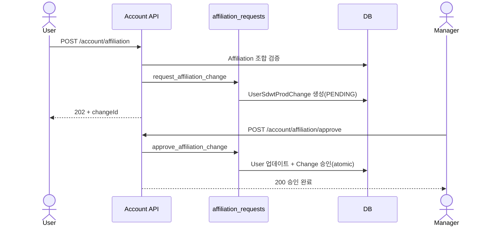
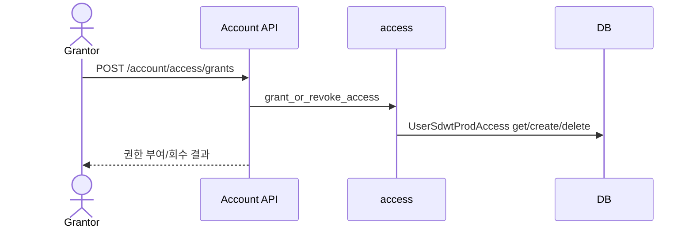
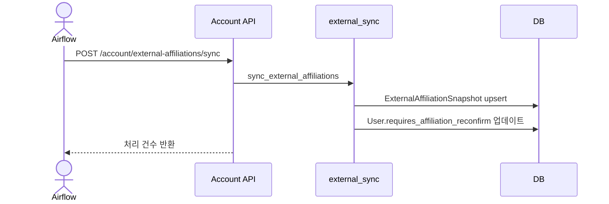

# Account 백엔드 문서

## 개요
- 사용자 프로필과 소속(user_sdwt_prod) 변경 요청/승인을 담당합니다.
- 접근 권한 부여/회수와 외부 예측 소속 동기화를 처리합니다.
- 다른 기능(Emails/Assistant/Drone)의 권한 계산에 필요한 접근 가능한 user_sdwt_prod 집합을 제공합니다.

## 책임 범위
- 소속 변경 요청/승인/재확인 흐름
- user_sdwt_prod 접근 권한 및 관리 권한 부여/회수
- 외부 소속 스냅샷 동기화 및 재확인 플래그 관리
- 라인/SDWT 선택 옵션 데이터 제공

## 엔드포인트
- `GET /api/v1/account/overview`
- `GET /api/v1/account/affiliation`
- `POST /api/v1/account/affiliation`
- `POST /api/v1/account/affiliation/approve`
- `GET /api/v1/account/affiliation/requests`
- `GET /api/v1/account/affiliation/reconfirm`
- `POST /api/v1/account/affiliation/reconfirm`
- `GET /api/v1/account/affiliation/jira-key`
- `POST /api/v1/account/affiliation/jira-key` (superuser 전용)
- `POST /api/v1/account/external-affiliations/sync` (Airflow 토큰 전용)
- `POST /api/v1/account/access/grants`
- `GET /api/v1/account/access/manageable`
- `GET /api/v1/account/line-sdwt-options`

## 핵심 모델/상태
- `User` (`account_user`)
  - 소속 필드: `department`, `line`, `user_sdwt_prod`
  - 재확인 플래그: `requires_affiliation_reconfirm`, `affiliation_confirmed_at`
- `UserProfile` (`account_user_profile`)
  - 역할: `admin | manager | viewer`
- `Affiliation` (`account_affiliation`)
  - `department/line/user_sdwt_prod` 허용 조합 + `jira_key`
- `UserSdwtProdAccess` (`account_user_sdwt_prod_access`)
  - 접근 권한/관리 권한(`can_manage`) 부여 기록
- `UserSdwtProdChange` (`account_user_sdwt_prod_change`)
  - 소속 변경 요청/승인/적용 이력 (상태: `PENDING/APPROVED/REJECTED`)
- `ExternalAffiliationSnapshot` (`account_external_affiliation_snapshot`)
  - 외부 예측 소속 스냅샷

## 주요 규칙/정책
- `is_superuser` 또는 `is_staff`는 대부분의 접근 제약을 우회합니다.
- 일반 사용자는 `UserSdwtProdAccess` + 본인 `user_sdwt_prod` 범위에서만 관리/조회가 가능합니다.
- `ensure_self_access`로 본인 소속 접근 행을 항상 보장합니다.

## 주요 흐름

### 1) 계정 요약 조회
`GET /api/v1/account/overview`
1. 인증 확인.
2. `get_account_overview`에서:
   - 접근 가능한 user_sdwt_prod 목록 구성 (`_current_access_list`).
   - 소속 변경 히스토리(`UserSdwtProdChange`) 직렬화.
   - 관리 가능한 그룹/멤버 조회 (`get_manageable_groups_with_members`).
   - Emails 요약 (`email_services.get_mailbox_access_summary_for_user`) 포함.
3. 통합 payload 반환.

### 2) 소속 변경 요청
`POST /api/v1/account/affiliation`
1. 인증 확인, JSON 파싱.
2. `department/line/user_sdwt_prod` 조합 유효성 검사 (`Affiliation` 존재 여부).
3. `effective_from` 파싱(미입력 시 현재 시각).
4. 기존 PENDING 요청 존재 여부 확인.
5. `UserSdwtProdChange` 생성 (status=PENDING).
6. 202 응답 + `changeId` 반환.

### 3) 소속 변경 승인/거절
`POST /api/v1/account/affiliation/approve`
1. 인증 확인, `changeId`/`decision` 파싱.
2. 승인 시:
   - `approve_affiliation_change` 실행:
     - approver가 `to_user_sdwt_prod` 관리 권한 보유인지 확인.
     - transaction으로 `User` 소속 필드 갱신 + `UserSdwtProdChange` 승인 처리.
     - `ensure_self_access`로 대상 사용자 self-access 보장.
3. 거절 시:
   - `reject_affiliation_change`로 상태 REJECTED 처리.

### 4) 소속 변경 요청 목록 조회
`GET /api/v1/account/affiliation/requests`
1. 인증 확인.
2. privileged 여부에 따라 조회 범위 결정:
   - privileged: 전체.
   - 일반: 관리 가능한 user_sdwt_prod + 본인 user_sdwt_prod 범위.
3. 상태/검색어/user_sdwt_prod 필터 + 페이지네이션 반환.

### 5) 소속 재확인 흐름
`GET /api/v1/account/affiliation/reconfirm`
1. 인증 확인.
2. `ExternalAffiliationSnapshot` 조회.
3. `requiresReconfirm`, `predictedUserSdwtProd`, `currentUserSdwtProd` 반환.

`POST /api/v1/account/affiliation/reconfirm`
1. 인증 확인, 입력 파싱.
2. 승인(accepted) 시 예측 소속 또는 입력값으로 소속 변경 요청 생성.
3. 성공 시 `requires_affiliation_reconfirm=False` 저장.

### 6) 외부 예측 소속 동기화
`POST /api/v1/account/external-affiliations/sync`
1. Airflow 토큰 인증 확인.
2. `ExternalAffiliationSnapshot` 업서트.
3. 예측 소속 변화 발생 시 사용자 `requires_affiliation_reconfirm=True` 설정.

### 7) 접근 권한 부여/회수
`POST /api/v1/account/access/grants`
1. 인증 확인.
2. 대상 user 조회 (`resolve_target_user`).
3. `grant_or_revoke_access` 실행:
   - 관리 권한 보유 여부 검사.
   - 부여 시 Access row 생성/갱신.
   - 회수 시 마지막 매니저 제거 방지.

### 8) 관리 가능 그룹/멤버 조회
`GET /api/v1/account/access/manageable`
1. 인증 확인.
2. `UserSdwtProdAccess` 기반으로 그룹/멤버 목록 구성 후 반환.

### 9) Jira Key 조회/갱신
`GET /api/v1/account/affiliation/jira-key`
1. lineId 필수.
2. lineId에 해당하는 `Affiliation` 존재 확인.
3. 해당 line의 `jira_key` 반환.

`POST /api/v1/account/affiliation/jira-key`
1. superuser 인증 확인.
2. lineId/jiraKey 유효성 검사.
3. lineId에 해당하는 모든 `Affiliation.jira_key` 갱신.

### 10) Line/SDWT 선택 옵션
`GET /api/v1/account/line-sdwt-options`
1. 인증 확인.
2. `(line_id, user_sdwt_prod)` 목록 조회 후 그룹화 응답.

## 설정/환경변수
- 없음

## 시퀀스 다이어그램

### 소속 변경 요청 → 승인

### 접근 권한 부여/회수

### 외부 소속 스냅샷 동기화 → 재확인

## 관련 코드 경로
- `apps/api/api/account/views.py`
- `apps/api/api/account/services/access.py`
- `apps/api/api/account/services/affiliation_requests.py`
- `apps/api/api/account/services/affiliations.py`
- `apps/api/api/account/services/external_sync.py`
- `apps/api/api/account/services/overview.py`
- `apps/api/api/account/services/users.py`
- `apps/api/api/account/selectors.py`
- `apps/api/api/account/models.py`
