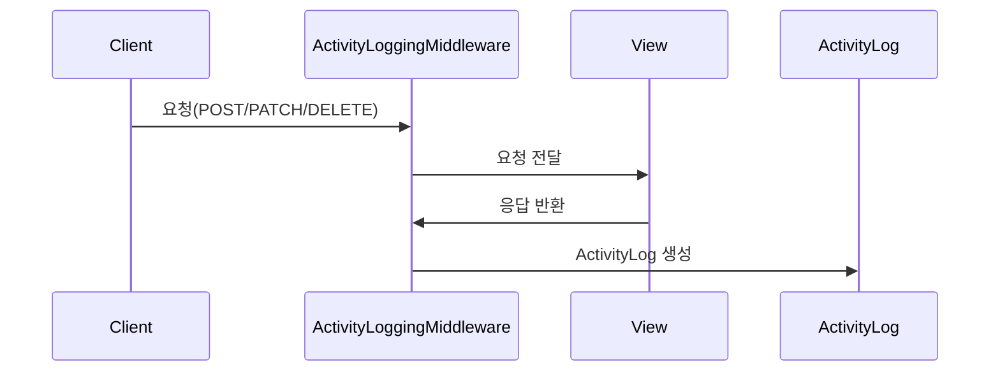
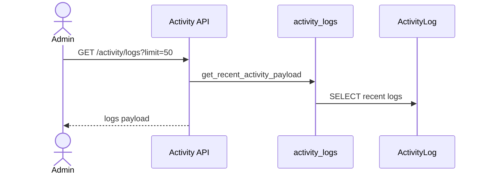

# Activity 백엔드 문서

## 개요
- ActivityLog 저장/조회 기능을 제공합니다.
- 실제 기록은 `ActivityLoggingMiddleware`(common)에서 자동 수행됩니다.
- 본 feature는 “조회” API만 제공하며, 생성은 미들웨어가 담당합니다.

## 책임 범위
- 액티비티 로그 조회 API 제공
- 로그 생성은 common 미들웨어에 위임

## 엔드포인트
- `GET /api/v1/activity/logs?limit=...`

## 핵심 모델
- `ActivityLog` (`activity_log`)
  - `user`, `action`, `path`, `method`, `status_code`, `metadata`, `created_at`

## 주요 규칙/정책
- `activity.view_activitylog` 또는 레거시 `api.view_activitylog` 권한이 필요합니다.
- `limit`은 기본 50, 최소 1, 최대 200으로 제한됩니다.
- `metadata.remote_addr`가 `172.18.0.1`이면 마스킹 처리됩니다.

## 주요 흐름

### 1) 로그 조회
`GET /api/v1/activity/logs`
1. 인증 확인.
2. 권한 확인.
3. `limit` 파싱 및 범위 제한.
4. `get_recent_activity_payload` → `get_recent_activity_logs` 조회.
5. `serialize_activity_log`로 직렬화 후 반환.

### 2) 로그 생성(미들웨어)
- `ActivityLoggingMiddleware`가 `POST/PUT/PATCH/DELETE` 요청을 감시합니다.
- 뷰에서 `set_activity_summary`, `set_activity_new_state` 등으로 추가 메타데이터를 주입할 수 있습니다.
- 응답 완료 시 `ActivityLog`가 저장됩니다.

## 설정/환경변수
- 없음

## 시퀀스 다이어그램

### 액티비티 로그 기록(미들웨어)

### 액티비티 로그 조회

## 관련 코드 경로
- `apps/api/api/activity/views.py`
- `apps/api/api/activity/services/activity_logs.py`
- `apps/api/api/activity/selectors.py`
- `apps/api/api/activity/serializers.py`
- `apps/api/api/activity/models.py`
- `apps/api/api/common/middleware.py`
- `apps/api/api/common/activity_logging.py`
