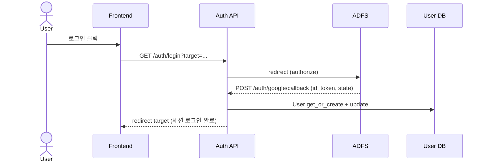
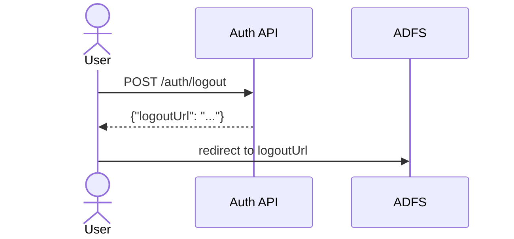

# Auth 백엔드 문서

## 개요
- ADFS/OIDC 기반 세션 로그인 흐름을 제공합니다.
- 로그인/콜백/로그아웃/현재 사용자 정보 조회 API를 제공합니다.
- state/nonce 검증과 리다이렉트 화이트리스트로 보안을 강화합니다.

## 책임 범위
- OIDC 로그인 시작/콜백 처리
- 세션 로그인/로그아웃 및 현재 사용자 조회
- 프론트 리다이렉트 엔드포인트 제공

## 엔드포인트
- `GET /api/v1/auth/config`
- `GET /api/v1/auth/login`
- `POST /auth/google/callback/` (OIDC form_post 콜백)
- `GET /api/v1/auth/me`
- `GET /api/v1/auth/logout`
- `POST /api/v1/auth/logout`
- `GET /api/v1/auth/` (FrontendRedirectView)

## 핵심 구성 요소
- OIDC 설정 로더 및 서명 검증 옵션
- state/nonce 인코딩/검증 로직
- 리다이렉트 화이트리스트 검사 (`ALLOWED_REDIRECT_HOSTS`)

## 주요 규칙/정책
- `OIDC_PROVIDER_CONFIGURED`가 false면 로그인 요청을 차단합니다.
- 콜백 state는 허용된 리다이렉트 호스트인지 검증합니다.
- 세션 nonce와 `id_token.nonce`가 일치해야 합니다.

## 주요 흐름

### 1) 설정 조회
`GET /api/v1/auth/config`
1. OIDC 설정값(issuer, clientId 등) 반환.
2. 프론트가 사용할 로그인/로그아웃/콜백 URL 포함.

### 2) 로그인 시작
`GET /api/v1/auth/login`
1. `OIDC_PROVIDER_CONFIGURED` 확인.
2. 요청 `target/next` 값을 state로 인코딩.
3. nonce 생성 → 세션 저장.
4. ADFS authorize endpoint로 리다이렉트.

### 3) OIDC 콜백 처리
`POST /auth/google/callback/`
1. form_post로 전달된 `id_token`/`state` 확인.
2. state 디코드 → target 복원 → 허용된 리다이렉트인지 검증.
3. 세션에 저장된 nonce와 id_token.nonce 비교.
4. id_token 디코드(현재 서명 검증 옵션 비활성).
5. 사용자 정보 추출 → `User` 생성 또는 업데이트.
6. Django 세션 로그인 → target으로 리다이렉트.

### 4) 현재 사용자 조회
`GET /api/v1/auth/me`
1. 로그인 상태 확인.
2. 기본 사용자 정보 + 소속 정보 반환.
3. `user_sdwt_prod`가 없으면 pending change의 `to_user_sdwt_prod` 포함.

### 5) 로그아웃
`GET /api/v1/auth/logout` 또는 `POST /api/v1/auth/logout`
1. Django 세션 로그아웃.
2. 세션 쿠키 제거.
3. POST는 로그아웃 URL JSON 반환.
4. GET은 IdP 로그아웃 URL로 즉시 리다이렉트.

## 설정/환경변수
- OIDC/ADFS
  - `ADFS_AUTH_URL`
  - `ADFS_LOGOUT_URL`
  - `OIDC_CLIENT_ID`
  - `OIDC_ISSUER`
  - `OIDC_REDIRECT_URI`
  - `ADFS_CER_PATH`
  - `ALLOWED_REDIRECT_HOSTS`
  - `OIDC_PROVIDER_CONFIGURED`
- 세션
  - `SESSION_COOKIE_AGE`
- 프론트 리다이렉트
  - `FRONTEND_BASE_URL`

## 시퀀스 다이어그램

### 로그인 + 콜백

### 로그아웃

## 관련 코드 경로
- `apps/api/api/auth/oidc.py`
- `apps/api/api/auth/oidc_utils.py`
- `apps/api/api/auth/views.py`
- `apps/api/api/auth/authentication.py`
- `apps/api/api/auth/urls.py`
- `apps/api/api/auth/callback_urls.py`
