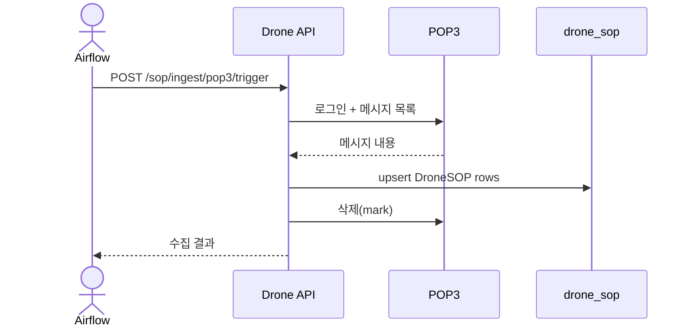
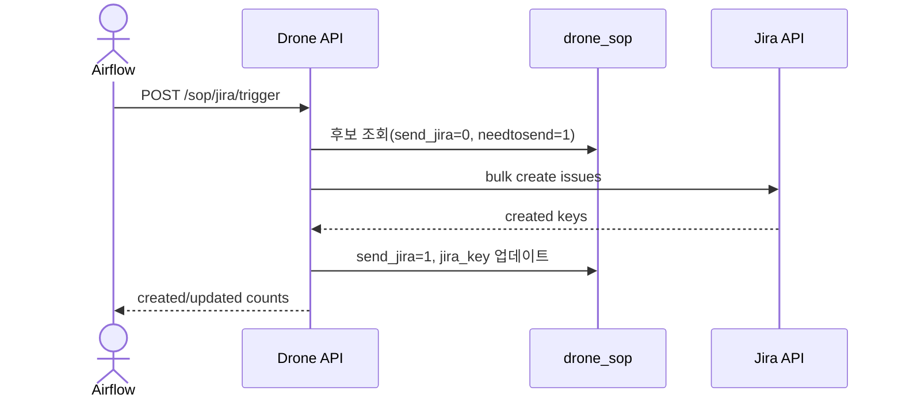
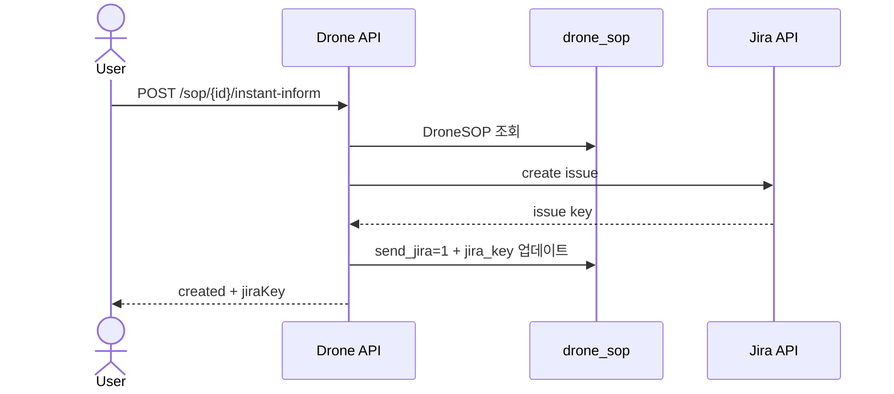

# Drone 백엔드 문서

## 개요
- Line Dashboard용 데이터 집계, Drone SOP 수집/관리, Jira 연동을 담당합니다.
- POP3(또는 더미 메일 API)에서 SOP 메일을 읽어 `drone_sop`에 업서트합니다.
- Jira 이슈를 자동 생성하거나 단건 즉시 인폼을 제공합니다.

## 책임 범위
- Early Inform CRUD 및 라인 히스토리 집계
- SOP POP3 수집 및 정규화 업서트
- Jira 이슈 생성(배치/단건) 및 상태 갱신

## 엔드포인트
- `GET /api/v1/line-dashboard/early-inform`
- `POST /api/v1/line-dashboard/early-inform`
- `PATCH /api/v1/line-dashboard/early-inform`
- `DELETE /api/v1/line-dashboard/early-inform`
- `GET /api/v1/line-dashboard/history`
- `GET /api/v1/line-dashboard/line-ids`
- `POST /api/v1/line-dashboard/sop/<sop_id>/instant-inform`
- `POST /api/v1/line-dashboard/sop/ingest/pop3/trigger`
- `POST /api/v1/line-dashboard/sop/jira/trigger`

## 핵심 모델
- `DroneSOP` (`drone_sop`)
  - SOP 식별키 `sop_key` (line/eqp/chamber/lot/main_step 조합)
  - 상태/전송 관련: `status`, `needtosend`, `send_jira`, `jira_key`
  - 기타: `user_sdwt_prod`, `knox_id`, `comment`, `custom_end_step`
- `DroneSopJiraTemplate` (`drone_sop_jira_template`)
  - line_id → Jira 템플릿 매핑
- `DroneSopJiraUserTemplate` (`drone_sop_jira_user_template`)
  - user_sdwt_prod → Jira 템플릿 매핑
- `DroneEarlyInform` (`drone_early_inform`)
  - 조기 알림 기준(라인/스텝) 및 custom_end_step

## 주요 규칙/정책
- Airflow 트리거 엔드포인트는 `ensure_airflow_token(require_bearer=True)`가 필요합니다.
- POP3 수집은 advisory lock으로 중복 실행을 방지합니다.
- Jira 템플릿은 user_sdwt_prod 우선, 없으면 line 기준을 사용합니다.

## 주요 흐름

### 1) Early Inform CRUD
`/line-dashboard/early-inform`
1. 인증 확인.
2. GET: lineId로 조기 알림 행 목록 조회.
3. POST: 신규 생성 (중복 시 409).
4. PATCH: 부분 업데이트 (id 필수).
5. DELETE: id 기반 삭제.
6. 각 변경은 ActivityLog 메타데이터에 기록됩니다.

### 2) 라인 히스토리 집계
`GET /line-dashboard/history`
1. `table/lineId/from/to/rangeDays` 파라미터 정규화.
2. `resolve_table_schema`로 테이블/타임스탬프 컬럼 확인.
3. line 필터 + 날짜 조건으로 SQL 생성.
4. 시간 버킷별 totals + dimension별 breakdown 조회 후 반환.

### 3) 라인 ID 목록
`GET /line-dashboard/line-ids`
1. account_affiliation 기반 distinct line_id 반환.

### 4) SOP POP3 수집
`POST /line-dashboard/sop/ingest/pop3/trigger` (Airflow 토큰 필요)
1. `ensure_airflow_token(require_bearer=True)` 검증.
2. advisory lock으로 중복 실행 방지.
3. 더미 모드면 더미 메일 API 호출, 아니면 POP3 접속.
4. 메일 제목 필터(`DRONE_INCLUDE_SUBJECT_PREFIXES`) 적용.
5. HTML 본문에서 `<data>` 태그 파싱 → SOP row 생성.
6. `needtosend` 계산 규칙 적용 + `custom_end_step` 반영.
7. `drone_sop` 테이블에 upsert.
8. POP3 메시지 삭제(또는 더미 삭제).
9. 90일 초과 데이터 prune.

### 5) Jira 생성(배치)
`POST /line-dashboard/sop/jira/trigger` (Airflow 토큰 필요)
1. `ensure_airflow_token(require_bearer=True)` 검증.
2. advisory lock으로 중복 실행 방지.
3. 후보 조회: `send_jira=0 && needtosend=1 && status=COMPLETE`.
4. project key 해석:
   - `account_affiliation`의 `jira_key` 사용.
5. 템플릿 해석:
   - `drone_sop_jira_user_template` → user_sdwt_prod 우선
   - 없으면 `drone_sop_jira_template`(line 기준)
6. CTTTM URL enrichment(옵션).
7. Jira API 호출(bulk 또는 single).
8. 성공 row는 `send_jira=1`, `jira_key`, `inform_step`, `informed_at` 업데이트.

### 6) SOP 즉시 인폼(단건)
`POST /line-dashboard/sop/<sop_id>/instant-inform`
1. 인증 확인.
2. `sop_id` 로우 조회 후 즉시 Jira 생성 실행.
3. 이미 `send_jira>0`이면 `already_informed` 응답.
4. 성공 시 `send_jira=1`, `instant_inform=1` 업데이트.

## 설정/환경변수
- POP3 수집
  - `DRONE_SOP_POP3_HOST`, `DRONE_SOP_POP3_PORT`
  - `DRONE_SOP_POP3_USERNAME`, `DRONE_SOP_POP3_PASSWORD`
  - `DRONE_SOP_POP3_USE_SSL`, `DRONE_SOP_POP3_TIMEOUT`
  - `DRONE_INCLUDE_SUBJECT_PREFIXES` / `DRONE_SOP_POP3_SUBJECT_CONTAINS`
  - `DRONE_SOP_DUMMY_MODE`
  - `DRONE_SOP_DUMMY_MAIL_MESSAGES_URL`
  - `DRONE_SOP_NEEDTOSEND_RULES`
- Jira 연동
  - `DRONE_JIRA_BASE_URL`, `DRONE_JIRA_TOKEN`, `DRONE_JIRA_USER`
  - `DRONE_JIRA_ISSUE_TYPE`
  - `DRONE_JIRA_USE_BULK_API`, `DRONE_JIRA_BULK_SIZE`
  - `DRONE_JIRA_CONNECT_TIMEOUT`, `DRONE_JIRA_READ_TIMEOUT`
  - `DRONE_JIRA_VERIFY_SSL`
- CTTTM 연동
  - `DRONE_CTTTM_TABLE_NAME`, `DRONE_CTTTM_BASE_URL`

## 시퀀스 다이어그램

### POP3 SOP 수집

### Jira 배치 생성

### SOP 즉시 인폼

## 관련 코드 경로
- `apps/api/api/drone/views.py`
- `apps/api/api/drone/services/early_inform.py`
- `apps/api/api/drone/services/sop_pop3.py`
- `apps/api/api/drone/services/sop_jira.py`
- `apps/api/api/drone/selectors.py`
- `apps/api/api/drone/models.py`
- `apps/api/api/drone/serializers.py`
