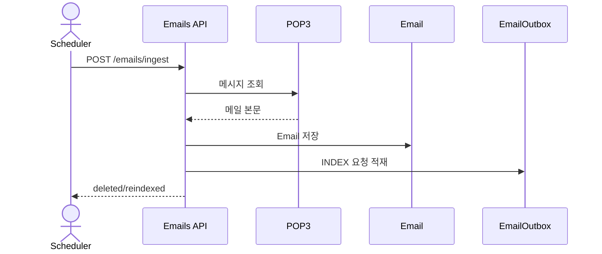
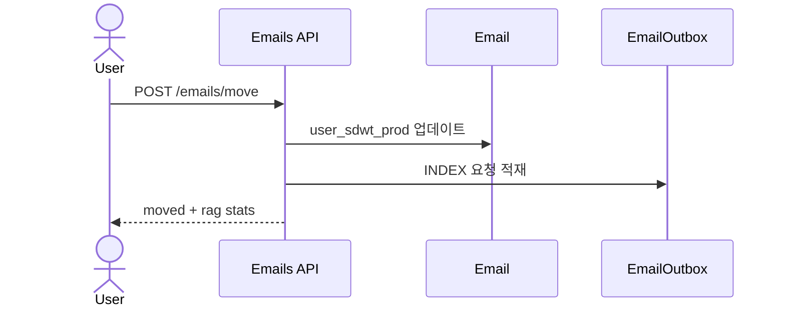
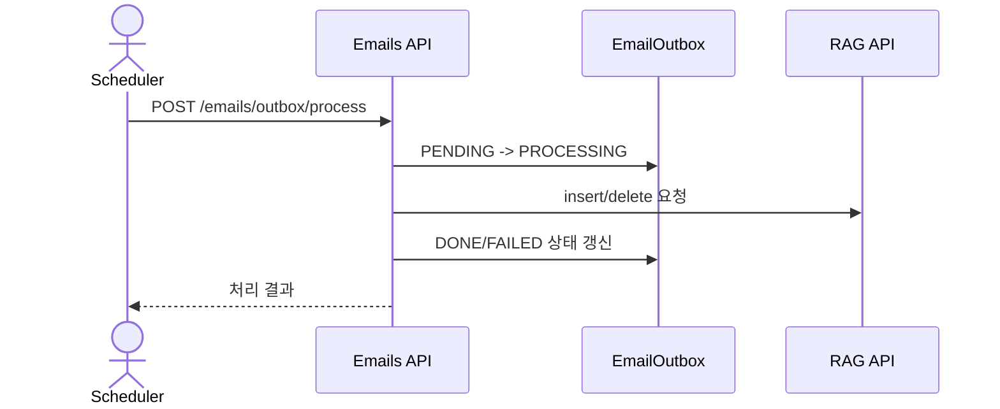

# Emails 백엔드 문서

## 개요
- POP3 메일 수집 → DB 저장 → RAG 인덱싱/삭제를 관리합니다.
- 메일함 접근 권한(user_sdwt_prod + sender_id)을 기반으로 조회/이동/삭제를 제한합니다.
- RAG 작업은 EmailOutbox로 비동기 처리합니다.

## 책임 범위
- 메일함/메일 조회 및 접근 제어
- 메일 이동/삭제 및 RAG 인덱싱 큐 처리
- POP3 수집 및 메일 분류/저장

## 엔드포인트
- `GET /api/v1/emails/inbox/`
- `GET /api/v1/emails/sent/`
- `GET /api/v1/emails/mailboxes/`
- `GET /api/v1/emails/mailboxes/members/`
- `GET /api/v1/emails/unassigned/`
- `POST /api/v1/emails/unassigned/claim/`
- `POST /api/v1/emails/move/`
- `POST /api/v1/emails/bulk-delete/`
- `GET /api/v1/emails/<email_id>/`
- `DELETE /api/v1/emails/<email_id>/`
- `GET /api/v1/emails/<email_id>/html/`
- `POST /api/v1/emails/ingest/`
- `POST /api/v1/emails/outbox/process/`

## 핵심 모델/상태
- `Email` (`emails_inbox`)
  - `classification_source`: `CONFIRMED_USER | PREDICTED_EXTERNAL | UNASSIGNED`
  - `rag_index_status`: `PENDING | INDEXED | SKIPPED`
  - `rag_doc_id`: RAG 문서 ID (기본 `email-{id}`)
- `EmailOutbox` (`emails_outbox`)
  - `action`: `INDEX | DELETE | RECLASSIFY | RECLASSIFY_ALL`
  - `status`: `PENDING | PROCESSING | DONE | FAILED`

## 주요 규칙/정책
- staff/superuser는 전체 메일함 접근이 가능하며, 일반 사용자는 접근 가능한 user_sdwt_prod와 sender_id 기준으로 제한됩니다.
- UNASSIGNED 메일함은 staff/superuser만 조회 가능합니다.
- 메일 이동/삭제는 권한 검증 후 RAG Outbox에 작업을 적재합니다.

## 주요 흐름

### 1) 메일함 목록/접근 요약
`GET /api/v1/emails/mailboxes/`
1. `resolve_access_control`로 인증/권한 확인.
2. privileged: 전체 known user_sdwt_prod + UNASSIGNED
3. 일반 사용자: 접근 가능한 user_sdwt_prod 집합
4. 결과에 `__sent__` 메일함을 추가해 반환.

`GET /api/v1/emails/mailboxes/members/`
1. 메일함 user_sdwt_prod 유효성 검사.
2. 접근 권한 확인 후 멤버 목록 + 발신자별 메일 수 반환.

### 2) 메일 조회
`GET /api/v1/emails/inbox/`
1. 접근 가능 집합 계산.
2. 검색/기간/발신자/수신자 필터 적용.
3. 메일함(user_sdwt_prod) 필터 적용.

`GET /api/v1/emails/sent/`
1. sender_id(knox_id) 기준 본인이 보낸 메일만 조회.

`GET /api/v1/emails/<email_id>/`
1. 메일 접근 권한 확인 후 상세 반환.

`GET /api/v1/emails/<email_id>/html/`
1. gzip 압축된 HTML 본문 복원 후 반환.

### 3) UNASSIGNED 메일 처리
`GET /api/v1/emails/unassigned/`
1. sender_id 기준 UNASSIGNED 메일 수 집계.

`POST /api/v1/emails/unassigned/claim/`
1. sender_id + 현재 user_sdwt_prod 확인.
2. UNASSIGNED 메일을 현재 user_sdwt_prod로 이동.
3. `classification_source=CONFIRMED_USER`, `rag_index_status=PENDING`.
4. RAG 인덱싱 요청 큐 적재.

### 4) 메일 이동/삭제
`POST /api/v1/emails/move/`
1. 접근 권한 검증 (메일 소유 + 이동 대상 권한).
2. user_sdwt_prod 변경.
3. RAG 인덱싱 요청 적재.

`POST /api/v1/emails/bulk-delete/`
1. 접근 권한 검증 (메일 소유 또는 sender_id).
2. Email 삭제 + RAG 삭제 요청 큐 적재.

`DELETE /api/v1/emails/<email_id>/`
1. 단건 삭제 + RAG 삭제 요청 큐 적재.

### 5) POP3 수집 → RAG 등록
`POST /api/v1/emails/ingest/`
1. POP3 메시지 순회.
2. 제목 제외 규칙 적용.
3. 메일 파싱(본문/헤더/수신자).
4. 발신자 기준 소속 판별:
   - User.user_sdwt_prod 우선
   - ExternalAffiliationSnapshot 예측값
   - UNASSIGNED fallback
5. Email 저장 (message_id 중복 방지).
6. CONFIRMED_USER 메일이면 RAG 인덱싱 Outbox 적재.
7. POP3 삭제 커밋.
8. 누락된 rag_doc_id 백필 시도.

### 6) RAG Outbox 처리
`POST /api/v1/emails/outbox/process/`
1. PENDING Outbox row를 PROCESSING으로 변경.
2. INDEX → RAG insert.
3. DELETE → RAG delete.
4. 실패 시 backoff 재시도, 최대 초과 시 FAILED.

## 설정/환경변수
- POP3 수집
  - `EMAIL_POP3_HOST`, `EMAIL_POP3_PORT`
  - `EMAIL_POP3_USERNAME`, `EMAIL_POP3_PASSWORD`
  - `EMAIL_POP3_USE_SSL`, `EMAIL_POP3_TIMEOUT`
  - `EMAIL_EXCLUDED_SUBJECT_PREFIXES`
- Mail API 발신
  - `MAIL_API_URL`, `MAIL_API_KEY`, `MAIL_API_SYSTEM_ID`, `MAIL_API_KNOX_ID`
- RAG 연계 설정은 `api.rag` 설정을 사용합니다.

## 시퀀스 다이어그램

### POP3 수집 → RAG 인덱싱

### 메일 이동 → RAG 재인덱싱

### Outbox 처리

## 관련 코드 경로
- `apps/api/api/emails/views.py`
- `apps/api/api/emails/permissions.py`
- `apps/api/api/emails/selectors.py`
- `apps/api/api/emails/services/ingest.py`
- `apps/api/api/emails/services/mutations.py`
- `apps/api/api/emails/services/mailbox.py`
- `apps/api/api/emails/services/rag.py`
- `apps/api/api/emails/services/query_filters.py`
- `apps/api/api/emails/models.py`
