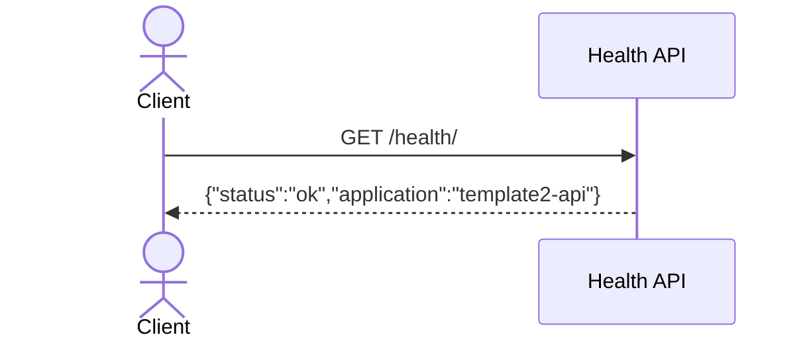

# Health 백엔드 문서

## 개요
- 서비스 상태 확인용 헬스 체크 엔드포인트를 제공합니다.
- 인증/권한 없이 접근 가능합니다.

## 책임 범위
- 헬스 체크 응답 제공

## 엔드포인트
- `GET /api/v1/health/`

## 핵심 구성 요소
- 없음

## 주요 규칙/정책
- 인증/권한 없이 접근 가능합니다.

## 주요 흐름
1. 요청 수신.
2. 고정된 JSON 반환: `{"status":"ok","application":"template2-api"}`

## 설정/환경변수
- 없음

## 시퀀스 다이어그램

## 관련 코드 경로
- `apps/api/api/health/views.py`
- `apps/api/api/health/urls.py`
