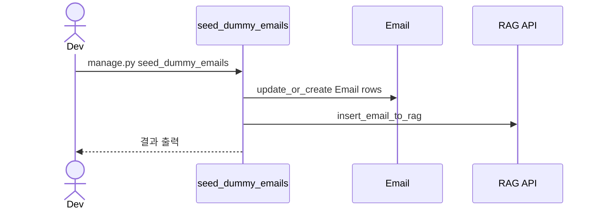

# Management 백엔드 문서

## 개요
- 개발/운영 보조용 Django management command를 제공합니다.
- 현재는 더미 이메일 시딩 명령이 포함됩니다.

## 책임 범위
- 운영/개발 보조 커맨드 제공

## 엔드포인트
- 없음 (management command 전용)

## 커맨드
- `seed_dummy_emails`

## 주요 흐름

### 1) 더미 이메일 시딩
`python manage.py seed_dummy_emails`
1. `DUMMY_ADFS_EMAIL` 환경변수에서 기본 수신자 결정.
2. 샘플 메일 2건을 `Email`에 update_or_create.
3. 각 메일에 대해 `register_email_to_rag` 호출.
4. 생성/업데이트/동기화 결과 출력.

## 설정/환경변수
- `DUMMY_ADFS_EMAIL`

## 시퀀스 다이어그램

## 관련 코드 경로
- `apps/api/api/management/commands/seed_dummy_emails.py`
