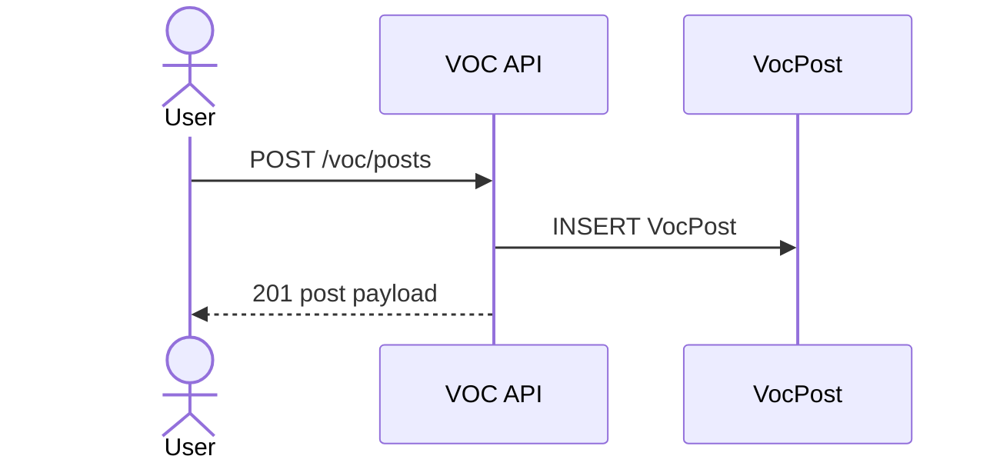
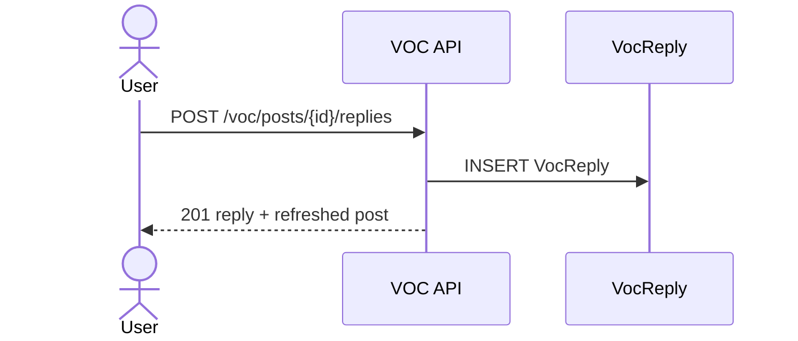

# VOC 백엔드 문서

## 개요
- VOC 게시글/답변(Q&A) CRUD API를 제공합니다.
- 게시글 상태 관리(접수/진행중/완료/반려)를 지원합니다.

## 책임 범위
- VOC 게시글/답변 CRUD
- 상태별 카운트 집계

## 엔드포인트
- `GET /api/v1/voc/posts`
- `POST /api/v1/voc/posts`
- `PATCH /api/v1/voc/posts/<post_id>`
- `DELETE /api/v1/voc/posts/<post_id>`
- `POST /api/v1/voc/posts/<post_id>/replies`

## 핵심 모델
- `VocPost` (`voc_post`)
  - `status`: `접수 | 진행중 | 완료 | 반려`
- `VocReply` (`voc_reply`)
  - 게시글 답변

## 주요 규칙/정책
- 게시글 수정/삭제는 작성자 또는 관리자 권한이 필요합니다.
- 상태 필터는 허용된 값만 허용합니다.

## 주요 흐름

### 1) 게시글 목록 조회
`GET /api/v1/voc/posts`
1. `status` 필터 유효성 검사.
2. posts + replies + author prefetch 조회.
3. 상태별 카운트 포함 응답.

### 2) 게시글 생성
`POST /api/v1/voc/posts`
1. 인증 확인.
2. title/content/status 유효성 검사.
3. 게시글 생성 후 직렬화.
4. ActivityLog 메타데이터 기록.

### 3) 게시글 수정/삭제
`PATCH /api/v1/voc/posts/<post_id>`
1. 인증 확인.
2. 작성자 또는 관리자 여부 확인.
3. 업데이트 필드 검증 후 저장.
4. ActivityLog before/after 기록.

`DELETE /api/v1/voc/posts/<post_id>`
1. 인증 확인.
2. 작성자 또는 관리자 여부 확인.
3. 삭제 후 상태 카운트 반환.

### 4) 답변 추가
`POST /api/v1/voc/posts/<post_id>/replies`
1. 인증 확인.
2. content 유효성 검사.
3. 답변 생성 + 게시글 refresh 반환.
4. ActivityLog 기록.

## 설정/환경변수
- 없음

## 시퀀스 다이어그램

### 게시글 생성

### 답변 추가

## 관련 코드 경로
- `apps/api/api/voc/views.py`
- `apps/api/api/voc/services/posts.py`
- `apps/api/api/voc/selectors.py`
- `apps/api/api/voc/serializers.py`
- `apps/api/api/voc/models.py`
